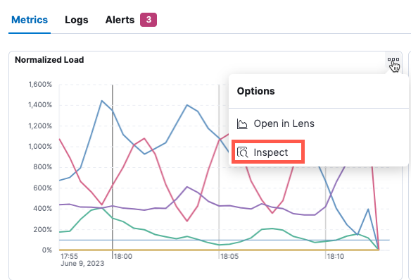
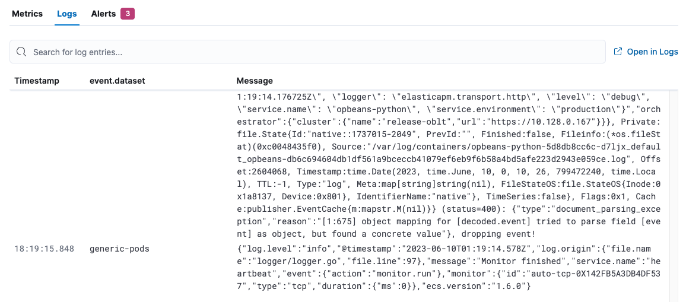

<DocBadge template="technical preview" />

import HostDetails from '../transclusion/host-details.mdx'

<DocCallOut template="beta" />
We'd love to get your feedback!
[Tell us what you think!](https://docs.google.com/forms/d/e/1FAIpQLScRHG8TIVb1Oq8ZhD4aks3P1TmgiM58TY123QpDCcBz83YC6w/viewform)

The **Hosts** page provides a metrics-driven view of your infrastructure backed
by an easy-to-use interface called Lens. On the **Hosts** page, you can view
health and performance metrics to help you quickly:

* Analyze and compare hosts without having to build new dashboards.
* Identify which hosts trigger the most alerts.
* Troubleshoot and resolve issues quickly.
* View historical data to rule out false alerts and identify root causes.
* Filter and search the data to focus on the hosts you care about the most.

To access the **Hosts** page, in your Observability project, go to
**Infrastructure** → **Hosts**.

To learn more about the metrics shown on this page, refer to the <DocLink slug="/serverless/observability/metrics-reference" /> documentation.

<DocCallOut title="Don't see any metrics?">

If you haven't added data yet, click **Add data** to search for and install an Elastic integration.

Need help getting started? Follow the steps in
<DocLink slug="/serverless/observability/get-started-with-metrics">Get started with system metrics</DocLink>.

</DocCallOut>

The **Hosts** page provides several ways to view host metrics:

* Overview tiles show the number of hosts returned by your search plus
    averages of key metrics, including CPU usage, normalized load, and memory usage.
    Max disk usage is also shown.

* The Host limit controls the maximum number of hosts shown on the page. The
    default is 50, which means the page shows data for the top 50 hosts based on the
    most recent timestamps. You can increase the host limit to see data for more
    hosts, but doing so may impact query performance.

* The Hosts table shows a breakdown of metrics for each host along with an alert count
    for any hosts with active alerts. You may need to page through the list
    or change the number of rows displayed on each page to see all of your hosts.

* Each host name is an active link to a <DocLink slug="/serverless/observability/analyze-hosts" section="view-host-details" text="host details" /> page,
    where you can explore enhanced metrics and other observability data related to the selected host.

* Table columns are sortable, but note that the sorting behavior is applied to
    the already returned data set.

* The tabs at the bottom of the page show an overview of the metrics, logs,
    and alerts for all hosts returned by your search.

<DocCallOut title="Tip">
    For more information about creating and viewing alerts, refer to <DocLink slug="/serverless/observability/alerting" />.
</DocCallOut>

## Filter the Hosts view

The **Hosts** page provides several mechanisms for filtering the data on the
page:

* Enter a search query using [(PRODUCT_NAME) Query Language](http://example.co)/kuery-query.html) to show metrics that match your search criteria. For example,
    to see metrics for hosts running on linux, enter `host.os.type : "linux"`.
    Otherwise you’ll see metrics for all your monitored hosts (up to the number of
    hosts specified by the host limit).

* Select additional criteria to filter the view:
    * In the **Operating System** list, select one or more operating systems
        to include (or exclude) metrics for hosts running the selected operating systems.

    * In the **Cloud Provider** list, select one or more cloud providers to
        include (or exclude) metrics for hosts running on the selected cloud providers.

    * In the **Service Name** list, select one or more service names to
        include (or exclude) metrics for the hosts running the selected services.
        Services must be instrumented by APM to be filterable.
        This filter is useful for comparing different hosts to determine whether a problem lies
        with a service or the host that it is running on.

    <DocCallOut title="Tip">
        Filtered results are sorted by _document count_.
        Document count is the number of events received by Elastic for the hosts that match your filter criteria.
    </DocCallOut>

* Change the date range in the time filter, or click and drag on a
    visualization to change the date range.

* Within a visualization, click a point on a line and apply filters to set other
    visualizations on the page to the same time and/or host.

## View metrics

On the **Metrics** tab, view metrics trending over time, including CPU usage,
normalized load, memory usage, disk usage, and other metrics related to disk IOPs and throughput.
Place your cursor over a line to view metrics at a specific
point in time. From within each visualization, you can choose to open the visualization in Lens.

To see metrics for a specific host, refer to <DocLink slug="/serverless/observability/analyze-hosts" section="view-host-details" text="View host details"/>.

<!--   TODO: Uncomment this section if/when the inspect option feature is added back in.

### Inspect and download metrics

You can access a text-based view of the data underlying
your metrics visualizations and optionally download the data to a
comma-separated (CSV) file.

Hover your cursor over a visualization, then in the upper-right corner, click
the ellipsis icon to inspect the data.

In the flyout, click **Download CSV** to download formatted or raw data to a CSV
file.

Click **View: Data** and notice that you can change the view to **Requests** to explore the request
used to fetch the data and the response returned from PRODUCT_NAME. On the **Request** tab, click links
to further inspect and analyze the request in the Dev Console or Search Profiler.-->

### Open in Lens

Metrics visualizations are powered by Lens, meaning you can continue your
analysis in Lens if you require more flexibility. Hover your cursor over a
visualization, then click the ellipsis icon in the upper-right corner to open
the visualization in Lens.

In Lens, you can examine all the fields and formulas used to create the
visualization, make modifications to the visualization, and save your changes.

For more information about using Lens, refer to the
[(PRODUCT_NAME) documentation about Lens](http://example.co)/lens.html).

## View logs

On the **Logs** tab of the **Hosts** page, view logs for the systems you are monitoring and search
for specific log entries. This view shows logs for all of the hosts returned by
the current query.

To see logs for a specific host, refer to <DocLink slug="/serverless/observability/analyze-hosts" section="view-host-details" text="View host details" />.

## View alerts

On the **Alerts** tab of the **Hosts** page, view active alerts to pinpoint problems. Use this view
to figure out which hosts triggered alerts and identify root causes. This view
shows alerts for all of the hosts returned by the current query.

From the **Actions** menu, you can choose to:

* Add the alert to a new or existing case.
* View rule details.
* View alert details.

To see alerts for a specific host, refer to <DocLink slug="/serverless/observability/analyze-hosts" section="view-host-details" text="View host details" />.

<DocCallOut title="Why are alerts missing from the Hosts page?">
    If your rules are triggering alerts that don't appear on the **Hosts** page,
    edit the rules and make sure they are correctly configured to associate the host name with the alert:

    * For Metric threshold or Custom threshold rules, select `host.name` in the **Group alerts by** field.
    * For Inventory rules, select **Host** for the node type under **Conditions**.

    To learn more about creating and managing rules, refer to <DocLink slug="/serverless/observability/alerting" />.
</DocCallOut>

## View host details

Without leaving the **Hosts** page, you can view enhanced metrics relating to
each host running in your infrastructure. In the list of hosts, find the host
you want to monitor, then click the **Toggle dialog with details**
icon <DocImage flatImage alt="" url="../images/expand-icon.png" /> to display the host details overlay.

<DocCallOut title="Tip">
To expand the overlay and view more detail, click **Open as page** in the upper-right corner.
</DocCallOut>

The host details overlay contains the following tabs:

<HostDetails />

<DocCallOut title="Note">
The metrics shown on the **Hosts** page are also available when viewing hosts on the **Inventory** page.
</DocCallOut>

## Why am I seeing dashed lines in charts?

There are a few reasons why you may see dashed lines in your charts.

* <DocLink slug="/serverless/observability/analyze-hosts" section="the-chart-interval-is-too-short">The chart interval is too short</DocLink>
* <DocLink slug="/serverless/observability/analyze-hosts" section="data-is-missing">Data is missing</DocLink>
* <DocLink slug="/serverless/observability/analyze-hosts" section="the-chart-interval-is-too-short-and-data-is-missing">The chart interval is too short and data is missing</DocLink>

### The chart interval is too short

In this example, the data emission rate is lower than the Lens chart interval.
A dashed line connects the known data points to make it easier to visualize trends in the data.

The chart interval is automatically set depending on the selected time duration.
To fix this problem, change the selected time range at the top of the page.

<DocCallOut title="Tip">
Want to dig in further while maintaining the selected time duration?
Hover over the chart you're interested in and select **Options** → **Open in Lens**.
Once in Lens, you can adjust the chart interval temporarily.
Note that this change is not persisted in the **Hosts** view.
</DocCallOut>

### Data is missing

A solid line indicates that the chart interval is set appropriately for the data transmission rate.
In this example, a solid line turns into a dashed line&mdash;indicating missing data.
You may want to investigate this time period to determine if there is an outage or issue.

### The chart interval is too short and data is missing

In the example shown in the screenshot,
the data emission rate is lower than the Lens chart interval **and** there is missing data.

This missing data can be hard to spot at first glance.
The green boxes outline regular data emissions, while the missing data is outlined in pink.
Similar to the above scenario, you may want to investigate the time period with the missing data
to determine if there is an outage or issue.

