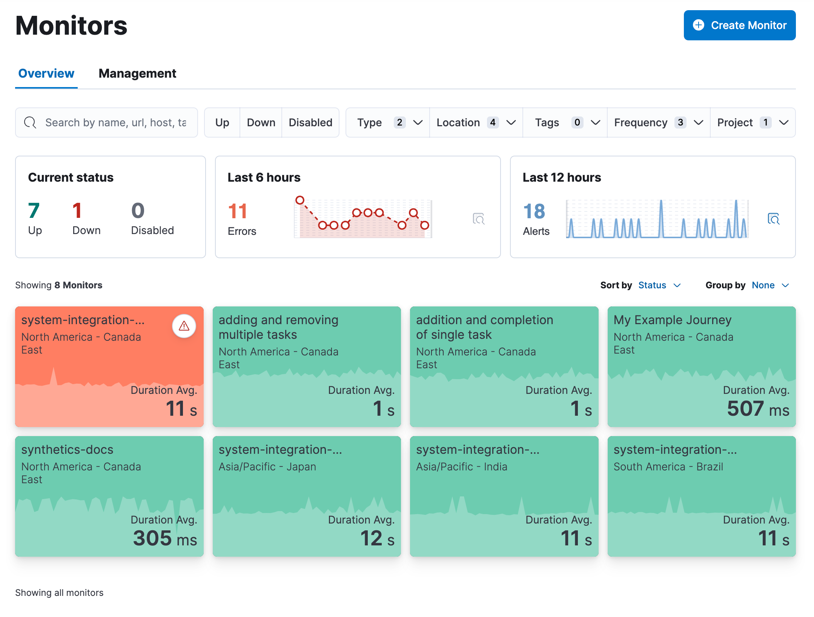

<DocBadge template="technical preview" />

<DocCallOut title="Note">

The Synthetics UI is for viewing result data from monitors created and managed
directly in the <DocLink slug="/serverless/observability/synthetics-get-started-ui">Synthetics UI</DocLink> or managed externally
using a <DocLink slug="/serverless/observability/synthetics-get-started-project">Synthetics project</DocLink>.
This can include both lightweight and browser-based monitors, and can include monitors
running from either Elastic's global managed testing infrastructure or from
<DocLink slug="/serverless/observability/synthetics-private-location">(PRODUCT_NAME)s</DocLink>.

</DocCallOut>

Synthetics periodically checks the status of your services and applications.
Monitor the availability of network endpoints and services using the following types of monitors:

* <DocLink slug="/serverless/observability/monitor-synthetics" section="lightweight-https-tcp-and-icmp-monitors">Lightweight HTTP/S, TCP, and ICMP monitors</DocLink>
* <DocLink slug="/serverless/observability/monitor-synthetics" section="browser-monitors">Browser monitors</DocLink>

## Lightweight HTTP/S, TCP, and ICMP monitors

You can monitor the status of network endpoints using the following lightweight checks:

<!--  lint ignore v4 v6-->
|  |  |
|---|---|
| **HTTP monitor** | Monitor your website. The HTTP monitor checks to make sure specific endpoints return the correct status code and display the correct text. |
| **ICMP monitor** | Check the availability of your hosts. The ICMP monitor uses ICMP (v4 and v6) Echo Requests to check the network reachability of the hosts you are pinging. This will tell you whether the host is available and connected to the network, but doesn't tell you if a service on the host is running or not. |
| **TCP monitor** | Monitor the services running on your hosts. The TCP monitor checks individual ports to make sure the service is accessible and running. |

To set up your first monitor, refer to <DocLink slug="/serverless/observability/synthetics-get-started">Get started</DocLink>.

## Browser monitors

Real browser synthetic monitoring enables you to test critical actions and requests that an end-user would make
on your site at predefined intervals and in a controlled environment.
Synthetic monitoring extends traditional end-to-end testing techniques because it allows your tests to run continuously on the cloud.
The result is rich, consistent, and repeatable data that you can trend and alert on.

For example, you can test popular user journeys, like logging in, adding items to a cart, and checking
out &mdash; actions that need to work for your users consistently.

You can run an automated Synthetics project on a real Chromium browser and
view each synthetic monitoring journey in your Observability project side-by-side with your other monitors.

Alerting helps you detect degraded performance or broken actions before your users do.
By receiving alerts early, you can fix issues before they impact your bottom line or customer experience.

To set up your first monitor, refer to <DocLink slug="/serverless/observability/synthetics-get-started">Get started</DocLink>.
