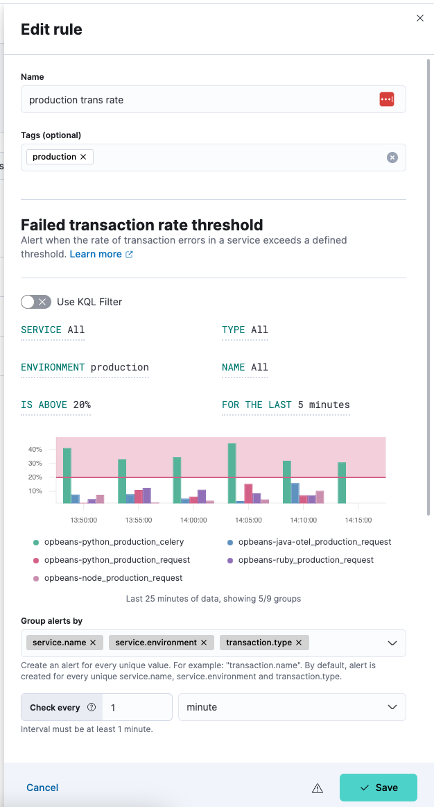

```{toctree}
:maxdepth: 2
:caption: Contents:
:hidden:

create-slo-burn-rate-alert-rule.md
triage-threshold-breaches.md
view-alerts.md
create-inventory-threshold-alert-rule.md
alerting.md
aiops-generate-anomaly-alerts.md
create-anomaly-alert-rule.md
aggregation-options.md
create-latency-threshold-alert-rule.md
triage-slo-burn-rate-breaches.md
create-elasticsearch-query-alert-rule.md
create-custom-threshold-alert-rule.md
alerting-connectors.md
create-error-count-threshold-alert-rule.md
create-failed-transaction-rate-threshold-alert-rule.md
rate-aggregation.md
```
<p><DocBadge template="technical preview" /></p>

import Roles from '../partials/roles.mdx'

<Roles role="Editor" goal="create and manage rules for alerting" />

Alerting enables you to define _rules_, which detect complex conditions within different apps and trigger actions when those conditions are met. Alerting provides a set of built-in connectors and rules for you to use.

## Observability rules

Learn more about Observability rules and how to create them:

<DocTable
  columns={[
    { title:  "Rule type", width: "20%" },
    { title:  "Name", width: "30%"  },
    { title:  "Detects when...", width: "50%" }
    ]}>

  <DocRow>
    <DocCell>AIOps</DocCell>
    <DocCell><DocLink slug="/serverless/observability/create-anomaly-alert-rule">Anomaly detection</DocLink></DocCell>
    <DocCell>Anomalies match specific conditions.</DocCell>
  </DocRow>
  <DocRow>
    <DocCell>APM</DocCell>
    <DocCell><DocLink slug="/serverless/observability/create-anomaly-alert-rule">APM anomaly</DocLink></DocCell>
    <DocCell>The latency, throughput, or failed transaction rate of a service is abnormal.</DocCell>
  </DocRow>
  <DocRow>
    <DocCell>Observability</DocCell>
    <DocCell><DocLink slug="/serverless/observability/create-anomaly-alert-rule">Custom threshold</DocLink></DocCell>
    <DocCell>An Observability data type reaches or exceeds a given value.</DocCell>
  </DocRow>
    <DocRow>
    <DocCell>Stack</DocCell>
    <DocCell><DocLink slug="/serverless/observability/create-elasticsearch-query-rule">(PRODUCT_NAME) query</DocLink></DocCell>
    <DocCell>Matches are found during the latest query run.</DocCell>
  </DocRow>
  <DocRow>
    <DocCell>APM</DocCell>
    <DocCell><DocLink slug="/serverless/observability/create-error-count-threshold-alert-rule">Error count threshold</DocLink></DocCell>
    <DocCell>The number of errors in a service exceeds a defined threshold.</DocCell>
  </DocRow>
  <DocRow>
    <DocCell>APM</DocCell>
    <DocCell><DocLink slug="/serverless/observability/create-failed-transaction-rate-threshold-alert-rule">Failed transaction rate threshold</DocLink></DocCell>
    <DocCell>The rate of transaction errors in a service exceeds a defined threshold.</DocCell>
  </DocRow>
    <DocRow>
    <DocCell>Metrics</DocCell>
    <DocCell><DocLink slug="/serverless/observability/create-inventory-threshold-alert-rule">Inventory</DocLink></DocCell>
    <DocCell>The infrastructure inventory exceeds a defined threshold.</DocCell>
  </DocRow>
  <DocRow>
    <DocCell>APM</DocCell>
    <DocCell><DocLink slug="/serverless/observability/create-latency-threshold-alert-rule">Latency threshold</DocLink></DocCell>
    <DocCell>The latency of a specific transaction type in a service exceeds a defined threshold.</DocCell>
  </DocRow>
  <DocRow>
    <DocCell>SLO</DocCell>
    <DocCell><DocLink slug="/serverless/observability/create-slo-burn-rate-alert-rule">SLO burn rate rule</DocLink></DocCell>
    <DocCell>The burn rate is above a defined threshold.</DocCell>
  </DocRow>
</DocTable>

## Creating rules and alerts

You start by defining the rule and how often it should be evaluated. You can extend these rules by adding an appropriate action (for example, send an email or create an issue) to be triggered when the rule conditions are met. These actions are defined within each rule and implemented by the appropriate connector for that action e.g. Slack, Jira. You can create any rules from scratch using the **Manage Rules** page, or you can create specific rule types from their respective UIs and benefit from some of the details being pre-filled (for example, Name and Tags).

* For APM alert types, you can select **Alerts and rules** and create rules directly from the **Services**, **Traces**, and **Dependencies** UIs.

* For SLO alert types, from the **SLOs** page open the **More actions** menu <DocIcon type="boxesHorizontal" title="action menu" /> for an SLO and select **Create new alert rule**. Alternatively, when you create a new SLO, the **Create new SLO burn rate alert rule** checkbox is enabled by default and will prompt you to <DocLink slug="/serverless/observability/create-slo-burn-rate-alert-rule">Create SLO burn rate rule</DocLink> upon saving the SLO.

<!--
Clarify available Logs rule
*/}

After a rule is created, you can open the **More actions** menu <DocIcon type="boxesHorizontal" title="More actions" /> and select **Edit rule** to check or change the definition, and/or add or modify actions.



From the action menu you can also:

* Disable or delete rule
* Clone rule
* Snooze rule notifications
* Run rule (without waiting for next scheduled check)
* Update API keys

## View rule details

Click on an individual rule on the **(PRODUCT_NAME)** page to view details including the rule name, status, definition, execution history, related alerts, and more.


A rule can have one of the following responses:

`failed`
  : The rule ran with errors.

`succeeded`
  : The rule ran without errors.

`warning`
  : The rule ran with some non-critical errors.

## Snooze and disable rules

The rule listing enables you to quickly snooze, disable, enable, or delete individual rules.

<!-- --> -->

When you snooze a rule, the rule checks continue to run on a schedule but the
alert will not trigger any actions. You can snooze for a specified period of
time, indefinitely, or schedule single or recurring downtimes.

<!-- --> -->

When a rule is in a snoozed state, you can cancel or change the duration of
this state.

<DocBadge template="technical preview" /> To temporarily suppress notifications for _all_ rules, create a <DocLink slug="/serverless/maintenance-windows" text="maintenance window"/>.

<!--  Remove tech preview?-->

## Import and export rules

To import and export rules, use <DocLink slug="/serverless/saved-objects">(PRODUCT_NAME)</DocLink>.

Rules are disabled on export.
You are prompted to re-enable the rule on successful import.

<!--  Can you import / export rules?-->
