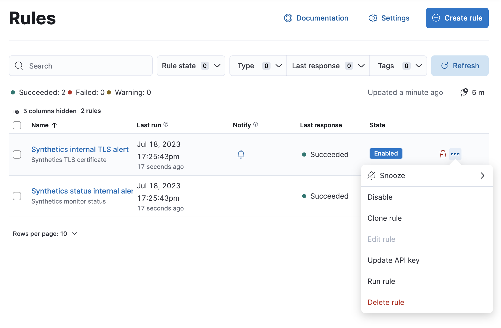
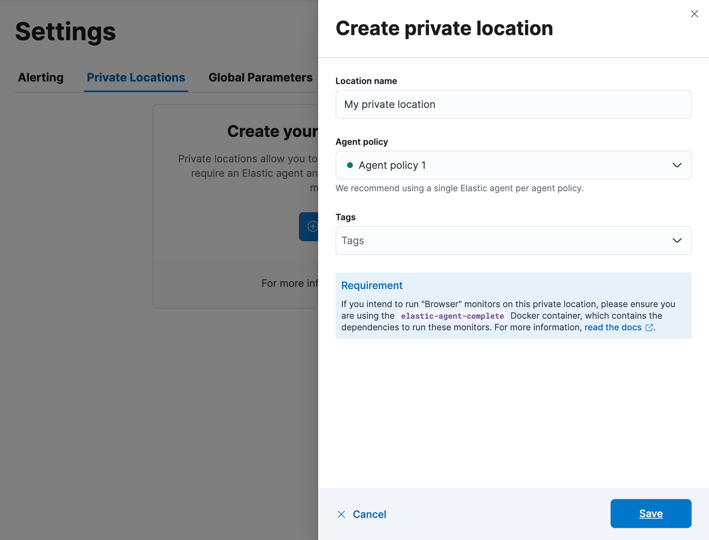
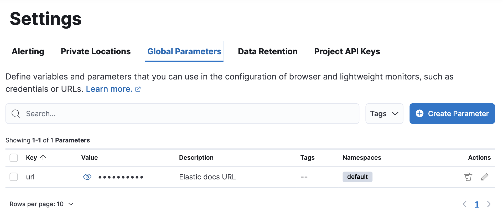
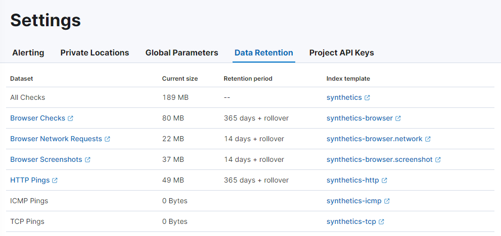
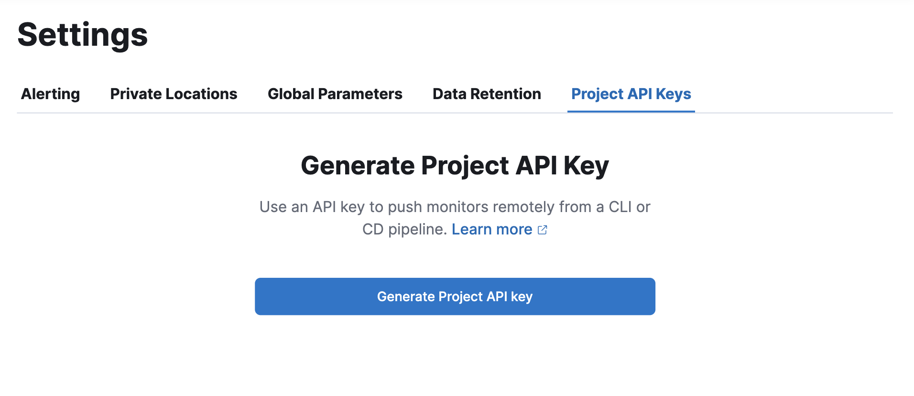

<DocBadge template="technical preview" />

There are several Synthetics settings you can adjust in your Observability project.

## Alerting

Alerting enables you to detect complex conditions using **rules** across Observability apps
and send a notification using **connectors**.

When you create a new synthetic monitor, new default synthetics rules will be applied.
To edit the default rules:

1. Click **Alerts and rules** in the top bar.
1. Select a rule to open a panel where you can edit the rule's configuration:
    * **Monitor status rule** for receiving notifications for errors and outages.
    * **TLS certificate rule** for receiving notifications when one or more of your HTTP or TCP
        lightweight monitors has a TLS certificate expiring within a specified threshold or when
        it exceeds an age limit.

However, the automatically created Synthetics internal alert is intentionally preconfigured,
and some configuration options can't be changed.
For example, you can't change how often it checks the rule.

If you need specific alerting behavior, set up a different rule.
To view all existing rules or create a new rule:

1. Click **Alerts and rules** in the top bar.
1. Click **Manage rules** to go to the _Rules_ page.

On the _Rules_ page, you can manage the default synthetics rules including snoozing rules,
disabling rules, deleting rules, and more.

<DocCallOut title="Note">

You can enable and disable default alerts for individual monitors in a few ways:

* In the UI when you <DocLink slug="/serverless/observability/synthetics-get-started-ui">create a monitor</DocLink>.
* In the UI _after_ a monitor is already created, on the **Monitors** page
    or on the **Edit monitor** page for the monitor.
* In a Synthetics project when <DocLink slug="/serverless/observability/synthetics-lightweight">configuring a lightweight monitor</DocLink>.

</DocCallOut>

In the **Alerting** tab on the Synthetics Settings page, you can add and configure connectors.
If you are running in Elastic Cloud, then an SMTP connector will automatically be configured,
allowing you to easily set up email alerts.
Read more about all available connectors in <DocLink slug="/serverless/observability/create-anomaly-alert-rule" section="action-types">Action types</DocLink>.

## PRODUCT_NAMEs

(PRODUCT_NAME)s allow you to run monitors from your own premises.

In the **(PRODUCT_NAME)s** tab, you can add and manage PRODUCT_NAMEs.
After you <DocLink slug="/serverless/observability/synthetics-private-location" section="set-up-agent">Set up PRODUCT_NAME</DocLink> and <DocLink slug="/serverless/observability/synthetics-private-location" section="connect-to-your-observability-project">Connect to your Observability project</DocLink>,
this is where you will add the PRODUCT_NAME so you can specify it as the location for
a monitor created using the Synthetics UI or a Synthetics project.

## Global parameters

Global parameters can be defined once and used across the configuration of lightweight and browser-based monitors.

In the **Global parameters** tab, you can define variables and parameters.
This is one of several methods you can use to define variables and parameters.
To learn more about the other methods and which methods take precedence over others, see <DocLink slug="/serverless/observability/synthetics-params-secrets">Work with params and secrets</DocLink>.

## Data retention

When you set up a synthetic monitor, data from the monitor is saved in [Elasticsearch data streams](http://example.co)/data-streams.html),
an append-only structure in Elasticsearch.
You can customize how long synthetics data is stored by creating your own index lifecycle policy
and attaching it to the relevant custom Component Template in Stack Management.

In the **Data retention** tab, use the links to jump to the relevant policy for each data stream.
Learn more about the data included in each data stream in <DocLink slug="/serverless/observability/synthetics-manage-retention">Manage data retention</DocLink>.

## Project API keys

Project API keys are used to push monitors created and managed in a Synthetics project remotely from a CLI or CD pipeline.

In the **Project API keys** tab, you can generate API keys to use with your Synthetics project.
Learn more about using API keys in <DocLink slug="/serverless/observability/synthetics-get-started-project">Create monitors with a Synthetics project</DocLink>.

<DocCallOut title="Important" color="warning">

To create a Project API key, you must be logged in as a user with
<DocLink slug="/serverless/observability/synthetics-feature-roles">Editor</DocLink> access.

</DocCallOut>

