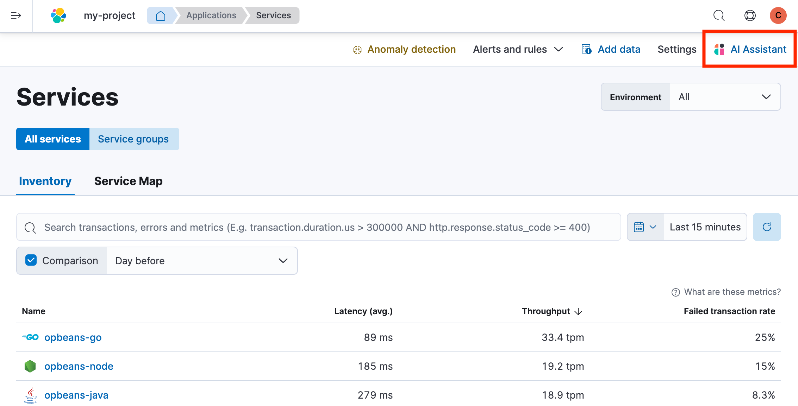
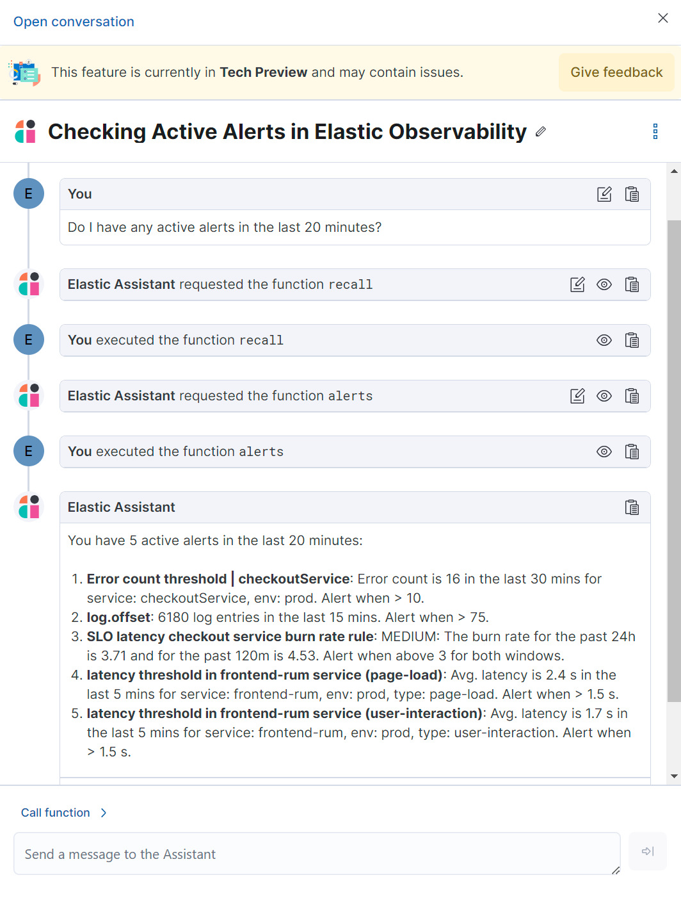
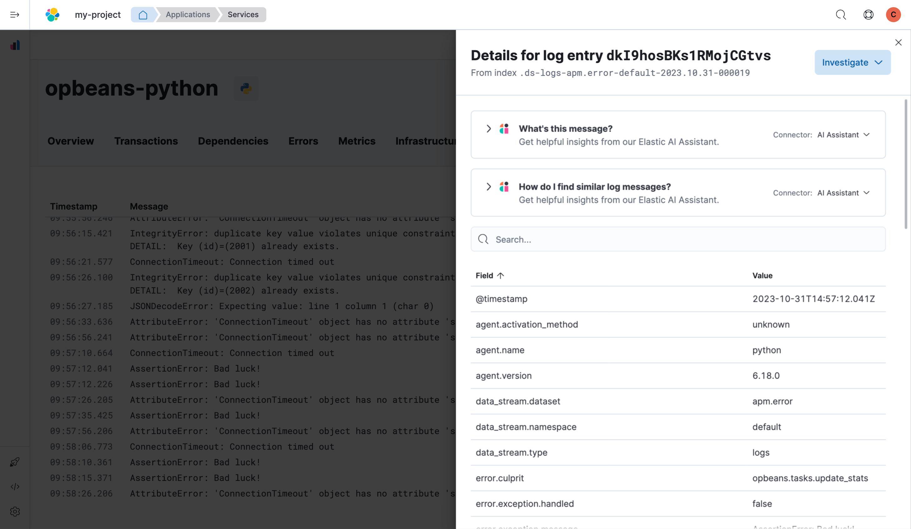
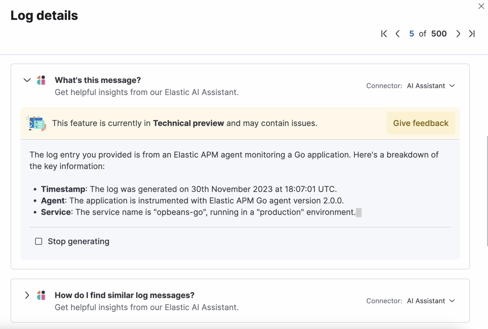
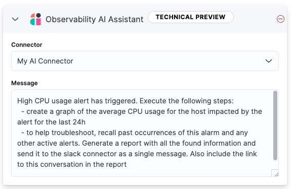
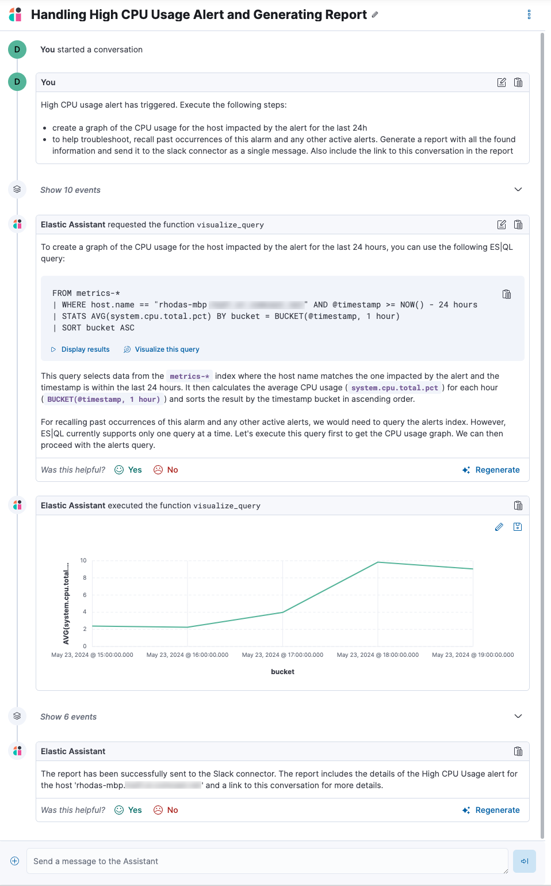

<p><DocBadge template="technical preview" /></p>

The AI Assistant uses generative AI to provide:

* **Chat**: Have conversations with the AI Assistant. Chat uses function calling to request, analyze, and visualize your data.
* **Contextual insights**: Open prompts throughout Observability that explain errors and messages and suggest remediation.


The AI Assistant integrates with your large language model (LLM) provider through our supported Elastic connectors:

* [OpenAI connector](http://example.co)/openai-action-type.html) for OpenAI or Azure OpenAI Service.
* [Amazon Bedrock connector](http://example.co)/bedrock-action-type.html) for Amazon Bedrock, specifically for the Claude models.

<DocCallOut title="Important" color="warning">
The AI Assistant is powered by an integration with your large language model (LLM) provider.
LLMs are known to sometimes present incorrect information as if it's correct.
Elastic supports configuration and connection to the LLM provider and your knowledge base,
but is not responsible for the LLM's responses.
</DocCallOut>

<DocCallOut title="Important" color="warning">
Also, the data you provide to the Observability AI assistant is _not_ anonymized, and is stored and processed by the third-party AI provider. This includes any data used in conversations for analysis or context, such as alert or event data, detection rule configurations, and queries. Therefore, be careful about sharing any confidential or sensitive details while using this feature.
</DocCallOut>

## Requirements

The AI assistant requires the following:

* An account with a third-party generative AI provider that supports function calling. The Observability AI Assistant supports the following providers:
    * OpenAI `gpt-4`+.
    * Azure OpenAI Service `gpt-4`(0613) or `gpt-4-32k`(0613) with API version `2023-07-01-preview` or more recent.
    * AWS Bedrock, specifically the Anthropic Claude models.
* The knowledge base requires a 4 GB PRODUCT_NAME node.

## Your data and the AI Assistant

Elastic does not use customer data for model training. This includes anything you send the model, such as alert or event data, detection rule configurations, queries, and prompts. However, any data you provide to the AI Assistant will be processed by the third-party provider you chose when setting up the OpenAI connector as part of the assistant setup.

Elastic does not control third-party tools, and assumes no responsibility or liability for their content, operation, or use, nor for any loss or damage that may arise from your using such tools. Please exercise caution when using AI tools with personal, sensitive, or confidential information. Any data you submit may be used by the provider for AI training or other purposes. There is no guarantee that the provider will keep any information you provide secure or confidential. You should familiarize yourself with the privacy practices and terms of use of any generative AI tools prior to use.

## Set up the AI Assistant

To set up the AI Assistant:

1. Create an authentication key with your AI provider to authenticate requests from the AI Assistant. You'll use this in the next step. Refer to your provider's documentation for information about creating authentication keys:
    * [OpenAI API keys](https://platform.openai.com/docs/api-reference)
    * [Azure OpenAI Service API keys](https://learn.microsoft.com/en-us/azure/cognitive-services/openai/reference)
    * [Amazon Bedrock authentication keys and secrets](https://docs.aws.amazon.com/bedrock/latest/userguide/security-iam.html)
1. From **Project settings** → **Management** → **Connectors**, create an [OpenAI](http://example.co)/openai-action-type.html) or [Amazon Bedrock](http://example.co)/bedrock-action-type.html) connector.
1. Authenticate communication between Observability and the AI provider by providing the following information:
    1. In the **URL** field, enter the AI provider's API endpoint URL.
    1. Under **Authentication**, enter the API key or access key/secret you created in the previous step.

## Add data to the AI Assistant knowledge base

<DocCallOut title="Important" color="warning">
**If you started using the AI Assistant in technical preview**,
any knowledge base articles you created using ELSER v1 will need to be reindexed or upgraded before they can be used.
Going forward, you must create knowledge base articles using ELSER v2.
You can either:

* Clear all old knowledge base articles manually and reindex them.
* Upgrade all knowledge base articles indexed with ELSER v1 to ELSER v2 using a [Python script](https://github.com/elastic/elasticsearch-labs/blob/main/notebooks/model-upgrades/upgrading-index-to-use-elser.ipynb).
</DocCallOut>

The AI Assistant uses [ELSER](http://example.co)/ml-nlp-elser.html), Elastic's semantic search engine, to recall data from its internal knowledge base index to create retrieval augmented generation (RAG) responses. Adding data such as Runbooks, GitHub issues, internal documentation, and Slack messages to the knowledge base gives the AI Assistant context to provide more specific assistance.

<DocCallOut title="Note">
Your AI provider may collect telemetry when using the AI Assistant. Contact your AI provider for information on how data is collected.
</DocCallOut>

You can add information to the knowledge base by asking the AI Assistant to remember something while chatting (for example, "remember this for next time"). The assistant will create a summary of the information and add it to the knowledge base.

You can also add external data to the knowledge base either in the Project Settings UI or using the PRODUCT_NAME Index API.

### Use the UI

To add external data to the knowledge base in the Project Settings UI:

1. Go to **Project Settings**.
1. In the _Other_ section, click **AI assistant for Observability settings**.
1. Then select the **Elastic AI Assistant for Observability**.
1. Switch to the **Knowledge base** tab.
1. Click the **New entry** button, and choose either:

    * **Single entry**: Write content for a single entry in the UI.
    * **Bulk import**: Upload a newline delimited JSON (`ndjson`) file containing a list of entries to add to the knowledge base.
      Each object should conform to the following format:

        ```
        {
          "id": "a_unique_human_readable_id",
          "text": "Contents of item",
        }
        ```

### Use the PRODUCT_NAME Index API

1. Ingest external data (GitHub issues, Markdown files, Jira tickets, text files, etc.) into PRODUCT_NAME using the PRODUCT_NAME [Index API](http://example.co)/docs-index_.html).
1. Reindex your data into the AI Assistant's knowledge base index by completing the following query in **Developer Tools** → **Console**. Update the following fields before reindexing:
    * `InternalDocsIndex`: Name of the index where your internal documents are stored.
    * `text_field`: Name of the field containing your internal documents' text.
    * `timestamp`: Name of the timestamp field in your internal documents.
    * `public`: If `true`, the document is available to all users with access to your Observability project. If `false`, the document is restricted to the user indicated in the following `user.name` field.
    * `user.name` (optional): If defined, restricts the internal document's availability to a specific user.
    * You can add a query filter to index specific documents.

```console
POST _reindex
{
    "source": {
        "index": "<InternalDocsIndex>",
        "_source": [
            "<text_field>",
            "<timestamp>",
            "namespace",
            "is_correction",
            "public",
            "confidence"
        ]
    },
    "dest": {
        "index": ".kibana-observability-ai-assistant-kb-000001",
        "pipeline": ".kibana-observability-ai-assistant-kb-ingest-pipeline"
    },
    "script": {
        "inline": "ctx._source.text = ctx._source.remove(\"<text_field>\");ctx._source.namespace=\"<space>\";ctx._source.is_correction=false;ctx._source.public=<public>;ctx._source.confidence=\"high\";ctx._source['@timestamp'] = ctx._source.remove(\"<timestamp>\");ctx._source['user.name'] = \"<user.name>\""
    }
}
```

## Interact with the AI Assistant

You can chat with the AI Assistant or interact with contextual insights located throughout Observability.
See the following sections for more on interacting with the AI Assistant.

<DocCallOut title="Tip">
After every answer the LLM provides, let us know if the answer was helpful.
Your feedback helps us improve the AI Assistant!
</DocCallOut>

### Chat with the assistant

Click **AI Assistant** in the upper-right corner where available to start the chat:



This opens the AI Assistant flyout, where you can ask the assistant questions about your instance:



### Suggest functions

<DocCallOut template="beta" />

The AI Assistant uses several functions to include relevant context in the chat conversation through text, data, and visual components. Both you and the AI Assistant can suggest functions. You can also edit the AI Assistant's function suggestions and inspect function responses. For example, you could use the `kibana` function to call a PRODUCT_NAME API on your behalf.

You can suggest the following functions:

<DocTable columns={[{ title: "Function", "width": "30%"  }, { title: "Description", "width": "70%"  }]}>
    <DocRow>
        <DocCell>`alerts`</DocCell>
        <DocCell>Get alerts for Observability.</DocCell>
    </DocRow>
    <DocRow>
        <DocCell>`elasticsearch`</DocCell>
        <DocCell>Call PRODUCT_NAME APIs on your behalf.</DocCell>
    </DocRow>
    <DocRow>
        <DocCell>`kibana`</DocCell>
        <DocCell>Call PRODUCT_NAME APIs on your behalf.</DocCell>
    </DocRow>
    <DocRow>
        <DocCell>`summarize`</DocCell>
        <DocCell>Summarize parts of the conversation.</DocCell>
    </DocRow>
    <DocRow>
        <DocCell>`visualize_query`</DocCell>
        <DocCell>Visualize charts for ES|QL queries.</DocCell>
    </DocRow>
</DocTable>

Additional functions are available when your cluster has APM data:

<DocTable columns={[{ title: "Function", "width": "30%"  }, { title: "Description", "width": "70%"  }]}>
    <DocRow>
        <DocCell>`get_apm_correlations`</DocCell>
        <DocCell>Get field values that are more prominent in the foreground set than the background set. This can be useful in determining which attributes (such as `error.message`, `service.node.name`, or `transaction.name`) are contributing to, for instance, a higher latency. Another option is a time-based comparison, where you compare before and after a change point.</DocCell>
    </DocRow>
    <DocRow>
        <DocCell>`get_apm_downstream_dependencies`</DocCell>
        <DocCell>Get the downstream dependencies (services or uninstrumented backends) for a service. Map the downstream dependency name to a service by returning both `span.destination.service.resource` and `service.name`. Use this to drill down further if needed.</DocCell>
    </DocRow>
    <DocRow>
        <DocCell>`get_apm_error_document`</DocCell>
        <DocCell>Get a sample error document based on the grouping name. This also includes the stacktrace of the error, which might hint to the cause.</DocCell>
    </DocRow>
    <DocRow>
        <DocCell>`get_apm_service_summary`</DocCell>
        <DocCell>Get a summary of a single service, including the language, service version, deployments, the environments, and the infrastructure that it is running in. For example, the number of pods and a list of their downstream dependencies. It also returns active alerts and anomalies.</DocCell>
    </DocRow>
    <DocRow>
        <DocCell>`get_apm_services_list`</DocCell>
        <DocCell>Get the list of monitored services, their health statuses, and alerts.</DocCell>
    </DocRow>
    <DocRow>
        <DocCell>`get_apm_timeseries`</DocCell>
        <DocCell>Display different APM metrics (such as throughput, failure rate, or latency) for any service or all services and any or all of their dependencies. Displayed both as a time series and as a single statistic. Additionally, the function  returns any changes, such as spikes, step and trend changes, or dips. You can also use it to compare data by requesting two different time ranges, or, for example, two different service versions.</DocCell>
    </DocRow>
</DocTable>

### Use contextual prompts

AI Assistant contextual prompts throughout Observability provide the following information:

- **Alerts**: Provides possible causes and remediation suggestions for log rate changes.
- **Application performance monitoring (APM)**: Explains APM errors and provides remediation suggestions.
- **Logs**: Explains log messages and generates search patterns to find similar issues.

<!--  Not included in initial serverless launch-->
<!--  - **Universal Profiling**: explains the most expensive libraries and functions in your fleet and provides optimization suggestions.-->
<!--  - **Infrastructure Observability**: explains the processes running on a host.-->

For example, in the log details, you'll see prompts for **What's this message?** and **How do I find similar log messages?**:



Clicking a prompt generates a message specific to that log entry.
You can continue a conversation from a contextual prompt by clicking **Start chat** to open the AI Assistant chat.



### Add the AI Assistant connector to alerting workflows

You can use the Observability AI Assistant connector to add AI-generated insights and custom actions to your alerting workflows.
To do this:

1. <DocLink slug="/serverless/observability/create-manage-rules" text="Create (or edit) an alerting rule" /> and specify the conditions that must be met for the alert to fire.
1. Under **Actions**, select the **Observability AI Assistant** connector type.
1. In the **Connector** list, select the AI connector you created when you set up the assistant.
1. In the **Message** field, specify the message to send to the assistant:



You can ask the assistant to generate a report of the alert that fired,
recall any information or potential resolutions of past occurrences stored in the knowledge base,
provide troubleshooting guidance and resolution steps,
and also include other active alerts that may be related.
As a last step, you can ask the assistant to trigger an action,
such as sending the report (or any other message) to a Slack webhook.

<DocCallOut title="NOTE">
    Currently you can only send messages to Slack, email, Jira, PagerDuty, or a webhook.
    Additional actions will be added in the future.
</DocCallOut>

When the alert fires, contextual details about the event—such as when the alert fired,
the service or host impacted, and the threshold breached—are sent to the AI Assistant,
along with the message provided during configuration.
The AI Assistant runs the tasks requested in the message and creates a conversation you can use to chat with the assistant:



<DocCallOut color="warning" title="Important">
    Conversations created by the AI Assistant are public and accessible to every user with permissions to use the assistant.
</DocCallOut>

It might take a minute or two for the AI Assistant to process the message and create the conversation.

Note that overly broad prompts may result in the request exceeding token limits.
For more information, refer to <DocLink slug="/serverless/observability/ai-assistant" section="token-limits" />
Also, attempting to analyze several alerts in a single connector execution may cause you to exceed the function call limit.
If this happens, modify the message specified in the connector configuration to avoid exceeding limits.

When asked to send a message to another connector, such as Slack,
the AI Assistant attempts to include a link to the generated conversation.


The Observability AI Assistant connector is called when the alert fires and when it recovers.

To learn more about alerting, actions, and connectors, refer to <DocLink slug="/serverless/observability/alerting" />.

## Known issues

<div id="token-limits"></div>

### Token limits

Most LLMs have a set number of tokens they can manage in single a conversation.
When you reach the token limit, the LLM will throw an error, and Elastic will display a "Token limit reached" error.
The exact number of tokens that the LLM can support depends on the LLM provider and model you're using.
If you are using an OpenAI connector, you can monitor token usage in **OpenAI Token Usage** dashboard.
For more information, refer to the [OpenAI Connector documentation](http://example.co)/openai-action-type.html#openai-connector-token-dashboard).

<span id="hello-world"></span>
