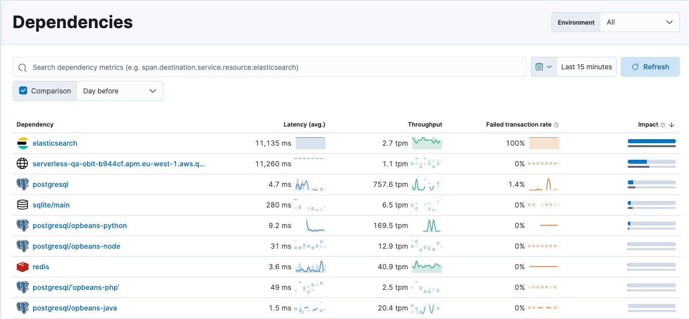
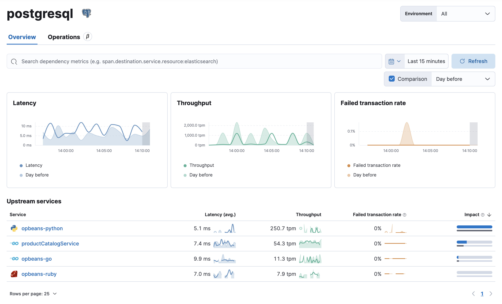
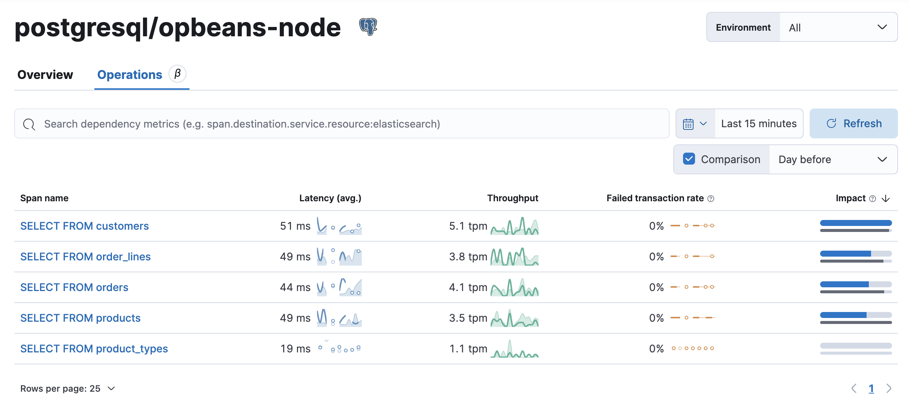
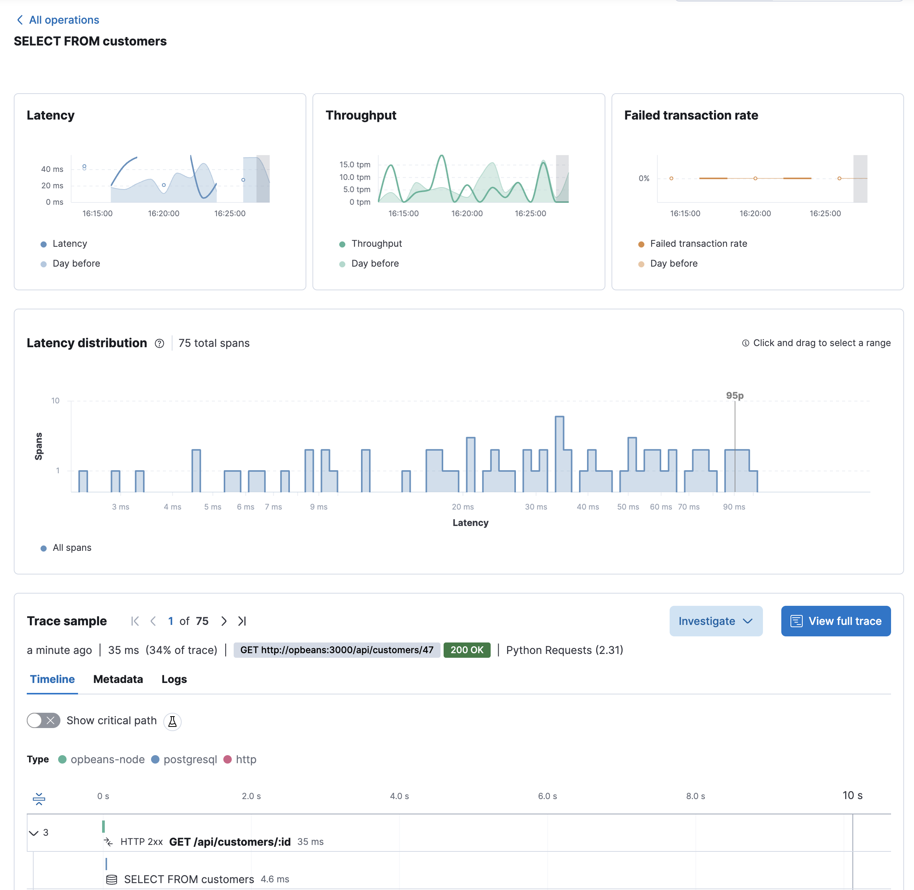

<DocBadge template="technical preview" />

import FeatureBeta from '../partials/feature-beta.mdx'

APM agents collect details about external calls made from instrumented services.
Sometimes, these external calls resolve into a downstream service that's instrumented &mdash; in these cases,
you can utilize <DocLink slug="/serverless/observability/apm-trace-sample-timeline" section="distributed-tracing">distributed tracing</DocLink> to drill down into problematic downstream services.
Other times, though, it's not possible to instrument a downstream dependency &mdash;
like with a database or third-party service.
**Dependencies** gives you a window into these uninstrumented, downstream dependencies.

Many application issues are caused by slow or unresponsive downstream dependencies.
And because a single, slow dependency can significantly impact the end-user experience,
it's important to be able to quickly identify these problems and determine the root cause.

Select a dependency to see detailed latency, throughput, and failed transaction rate metrics.

When viewing a dependency, consider your pattern of usage with that dependency.
If your usage pattern _hasn't_ increased or decreased,
but the experience has been negatively affected&mdash;either with an increase in latency or errors&mdash;there's
likely a problem with the dependency that needs to be addressed.

If your usage pattern _has_ changed, the dependency view can quickly show you whether
that pattern change exists in all upstream services, or just a subset of your services.
You might then start digging into traces coming from
impacted services to determine why that pattern change has occurred.

## Operations

<FeatureBeta feature="Dependency operations" />

**Dependency operations** provides a granular breakdown of the operations/queries a dependency is executing.

Selecting an operation displays the operation's impact and performance trends over time, via key metrics like latency, throughput, and failed transaction rate. In addition, the <DocLink slug="/serverless/observability/apm-trace-sample-timeline">**Trace sample timeline**</DocLink> provides a visual drill-down into an end-to-end trace sample.

