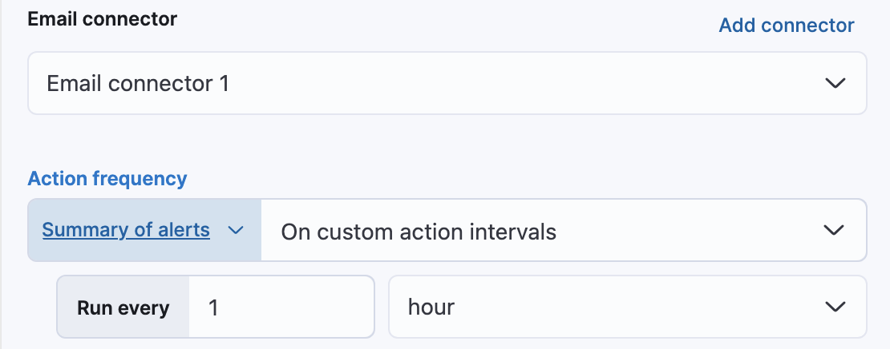
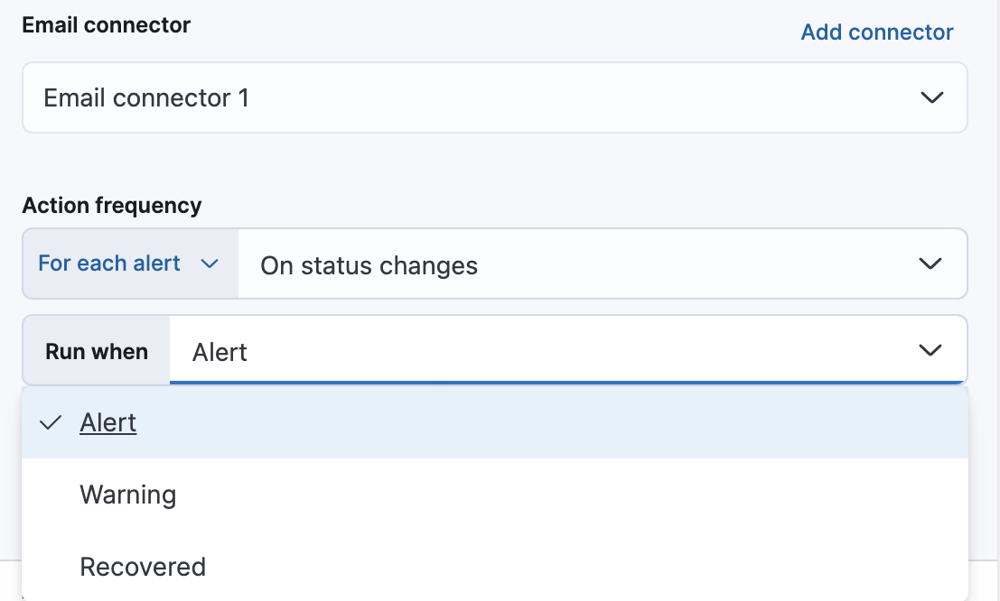
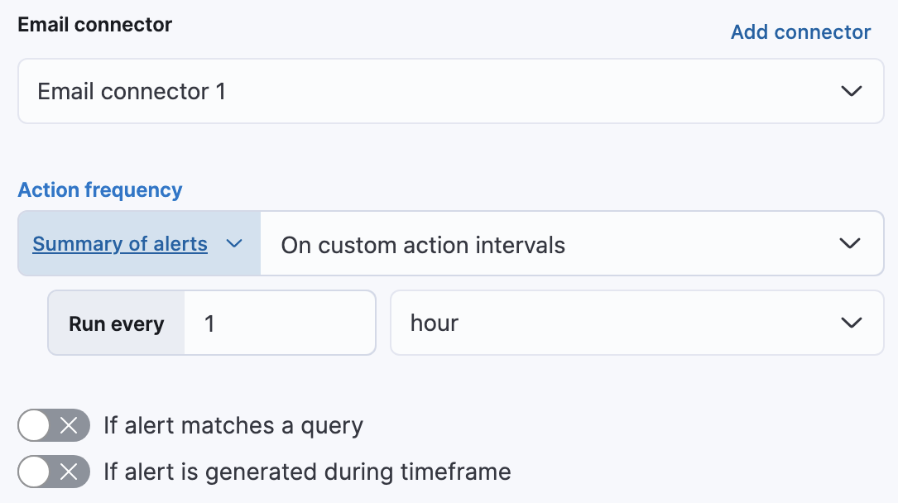

<DocBadge template="technical preview" />

import Connectors from './alerting-connectors.mdx'

import Roles from '../partials/roles.mdx'

<Roles role="Editor" goal="create inventory threshold rules" />

Based on the resources listed on the **Inventory** page within the PRODUCT_NAME,
you can create a threshold rule to notify you when a metric has reached or exceeded a value for a specific
resource or a group of resources within your infrastructure.

Additionally, each rule can be defined using multiple
conditions that combine metrics and thresholds to create precise notifications and reduce false positives.

1. To access this page, go to **Observability** -> **Infrastructure**.
1. On the **Inventory** page or the **Metrics Explorer** page, click **Alerts and rules** -> **Infrastructure**.
1. Select **Create inventory rule**.

<DocCallOut title="Tip">

When you select **Create inventory alert**, the parameters you configured on the **Inventory** page will automatically
populate the rule. You can use the Inventory first to view which nodes in your infrastructure you'd
like to be notified about and then quickly create a rule in just a few clicks.

</DocCallOut>

## Inventory conditions

Conditions for each rule can be applied to specific metrics relating to the inventory type you select.
You can choose the aggregation type, the metric, and by including a warning threshold value, you can be
alerted on multiple threshold values based on severity scores. When creating the rule, you can still get
notified if no data is returned for the specific metric or if the rule fails to query PRODUCT_NAME.

In this example, Kubernetes Pods is the selected inventory type. The conditions state that you will receive
a critical alert for any pods within the `ingress-nginx` namespace with a memory usage of 95% or above
and a warning alert if memory usage is 90% or above.
The chart shows the results of applying the rule to the last 20 minutes of data.
Note that the chart time range is 20 times the value of the look-back window specified in the `FOR THE LAST` field.

## Add actions

You can extend your rules with actions that interact with third-party systems, write to logs or indices, or send user notifications. You can add an action to a rule at any time. You can create rules without adding actions, and you can also define multiple actions for a single rule.

To add actions to rules, you must first create a connector for that service (for example, an email or external incident management system), which you can then use for different rules, each with their own action frequency.

<DocAccordion buttonContent="Connector types">
Connectors provide a central place to store connection information for services and integrations with third party systems.
The following connectors are available when defining actions for alerting rules:

<Connectors />

For more information on creating connectors, refer to <DocLink slug="/serverless/action-connectors">Connectors</DocLink>.

</DocAccordion>

<DocAccordion buttonContent="Action frequency">
After you select a connector, you must set the action frequency. You can choose to create a summary of alerts on each check interval or on a custom interval. For example, send email notifications that summarize the new, ongoing, and recovered alerts each hour:

<!--  NOTE: This is an autogenerated screenshot. Do not edit it directly.-->

Alternatively, you can set the action frequency such that you choose how often the action runs (for example, at each check interval, only when the alert status changes, or at a custom action interval). In this case, you define precisely when the alert is triggered by selecting a specific
threshold condition: `Alert`, `Warning`, or `Recovered` (a value that was once above a threshold has now dropped below it).

<!--  NOTE: This is an autogenerated screenshot. Do not edit it directly.-->

You can also further refine the conditions under which actions run by specifying that actions only run when they match a KQL query or when an alert occurs within a specific time frame:

- **If alert matches query**: Enter a KQL query that defines field-value pairs or query conditions that must be met for notifications to send. The query only searches alert documents in the indices specified for the rule.
- **If alert is generated during timeframe**: Set timeframe details. Notifications are only sent if alerts are generated within the timeframe you define.

</DocAccordion>

<DocAccordion buttonContent="Action variables">
Use the default notification message or customize it.
You can add more context to the message by clicking the Add variable icon <DocIcon type="indexOpen" title="Add variable" /> and selecting from a list of available variables.

The following variables are specific to this rule type.
You can also specify [variables common to all rules](http://example.co)/rule-action-variables.html).

<DocDefList>
    <DocDefTerm>`context.alertDetailsUrl`</DocDefTerm>
    <DocDefDescription>
        Link to the alert troubleshooting view for further context and details. This will be an empty string if the `server.publicBaseUrl` is not configured.
    </DocDefDescription>
    <DocDefTerm>`context.alertState`</DocDefTerm>
    <DocDefDescription>
        Current state of the alert.
    </DocDefDescription>
    <DocDefTerm>`context.cloud`</DocDefTerm>
    <DocDefDescription>
        The cloud object defined by ECS if available in the source.
    </DocDefDescription>
    <DocDefTerm>`context.container`</DocDefTerm>
    <DocDefDescription>
        The container object defined by ECS if available in the source.
    </DocDefDescription>
    <DocDefTerm>`context.group`</DocDefTerm>
    <DocDefDescription>
        Name of the group reporting data.
    </DocDefDescription>
    <DocDefTerm>`context.host`</DocDefTerm>
    <DocDefDescription>
        The host object defined by ECS if available in the source.
    </DocDefDescription>
    <DocDefTerm>`context.labels`</DocDefTerm>
    <DocDefDescription>
        List of labels associated with the entity where this alert triggered.
    </DocDefDescription>
    <DocDefTerm>`context.metric`</DocDefTerm>
    <DocDefDescription>
        The metric name in the specified condition. Usage: (`ctx.metric.condition0`, `ctx.metric.condition1`, and so on).
    </DocDefDescription>
    <DocDefTerm>`context.orchestrator`</DocDefTerm>
    <DocDefDescription>
        The orchestrator object defined by ECS if available in the source.
    </DocDefDescription>
    <DocDefTerm>`context.originalAlertState`</DocDefTerm>
    <DocDefDescription>
        The state of the alert before it recovered. This is only available in the recovery context.
    </DocDefDescription>
    <DocDefTerm>`context.originalAlertStateWasALERT`</DocDefTerm>
    <DocDefDescription>
        Boolean value of the state of the alert before it recovered. This can be used for template conditions. This is only available in the recovery context.
    </DocDefDescription>
    <DocDefTerm>`context.originalAlertStateWasWARNING`</DocDefTerm>
    <DocDefDescription>
        Boolean value of the state of the alert before it recovered. This can be used for template conditions. This is only available in the recovery context.
    </DocDefDescription>
    <DocDefTerm>`context.reason`</DocDefTerm>
    <DocDefDescription>
        A concise description of the reason for the alert.
    </DocDefDescription>
    <DocDefTerm>`context.tags`</DocDefTerm>
    <DocDefDescription>
        List of tags associated with the entity where this alert triggered.
    </DocDefDescription>
    <DocDefTerm>`context.threshold`</DocDefTerm>
    <DocDefDescription>
        The threshold value of the metric for the specified condition. Usage: (`ctx.threshold.condition0`, `ctx.threshold.condition1`, and so on)
    </DocDefDescription>
    <DocDefTerm>`context.timestamp`</DocDefTerm>
    <DocDefDescription>
        A timestamp of when the alert was detected.
    </DocDefDescription>
    <DocDefTerm>`context.value`</DocDefTerm>
    <DocDefDescription>
        The value of the metric in the specified condition. Usage: (`ctx.value.condition0`, `ctx.value.condition1`, and so on).
    </DocDefDescription>
    <DocDefTerm>`context.viewInAppUrl`</DocDefTerm>
    <DocDefDescription>
        Link to the alert source.
    </DocDefDescription>
</DocDefList>

</DocAccordion>

## Settings

With infrastructure threshold rules, it's not possible to set an explicit index pattern as part of the configuration. The index pattern
is instead inferred from **Metrics indices** on the <DocLink slug="/serverless/observability/configure-intra-settings">Settings</DocLink> page of the PRODUCT_NAME.

With each execution of the rule check, the **Metrics indices** setting is checked, but it is not stored when the rule is created.
