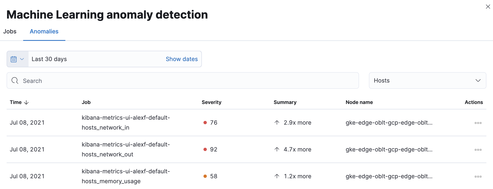

<DocBadge template="technical preview" />

import Roles from '../partials/roles.mdx'

<Roles role="Editor" goal="create PRODUCT_NAME jobs" />

You can create PRODUCT_NAME jobs to detect and inspect memory usage and network traffic anomalies for hosts and Kubernetes pods.

You can model system memory usage, along with inbound and outbound network traffic across hosts or pods.
You can detect unusual increases in memory usage and unusually high inbound or outbound traffic across hosts or pods.

## Enable PRODUCT_NAME jobs for hosts or Kubernetes pods

Create a PRODUCT_NAME job to detect anomalous memory usage and network traffic automatically.

After creating PRODUCT_NAME jobs, you cannot change the settings.
You can recreate these jobs later.
However, you will remove any previously detected anomalies.

<!--  lint ignore anomaly-detection observability-->
1. In your Observability project, go to **Infrastructure** → **Inventory**
and click the **Anomaly detection** link at the top of the page.
1. Under **Hosts** or **Kubernetes Pods**, click **Enable** to create a PRODUCT_NAME job.
1. Choose a start date for the PRODUCT_NAME analysis. PRODUCT_NAME jobs analyze the last four weeks of data and continue to run indefinitely.
1. Select a partition field.
    Partitions allow you to create independent models for different groups of data that share similar behavior.
    For example, you may want to build separate models for machine type or cloud availability zone so that anomalies are not weighted equally across groups.
1. By default, PRODUCT_NAME jobs analyze all of your metric data.
    You can filter this list to view only the jobs or metrics that you are interested in.
    For example, you can filter by job name and node name to view specific PRODUCT_NAME jobs for that host.
1. Click **Enable jobs**.
1. You're now ready to explore your metric anomalies. Click **Anomalies**.

The **Anomalies** table displays a list of each single metric PRODUCT_NAME job for the specific host or Kubernetes pod.
By default, anomaly jobs are sorted by time to show the most recent job.

Along with each anomaly job and the node name,
detected anomalies with a severity score equal to 50 or higher are listed.
These scores represent a severity of "warning" or higher in the selected time period.
The **summary** value represents the increase between the actual value and the expected ("typical") value of the metric in the anomaly record result.

To drill down and analyze the metric anomaly,
select **Actions → Open in Anomaly Explorer** to view the Anomaly Explorer.
You can also select **Actions** → **Show in Inventory** to view the host or Kubernetes pods Inventory page,
filtered by the specific metric.

<DocCallOut title="Note">

These predefined PRODUCT_NAME use [custom rules](http://example.co)/ml-rules.html).
To update the rules in the Anomaly Explorer, select **Actions** → **Configure rules**.
The changes only take effect for new results.
If you want to apply the changes to existing results, clone and rerun the job.

</DocCallOut>

## History chart

On the **Inventory** page, click **Show history** to view the metric values within the selected time frame.
Detected anomalies with an anomaly score equal to 50 or higher are highlighted in red.
To examine the detected anomalies, use the Anomaly Explorer.

