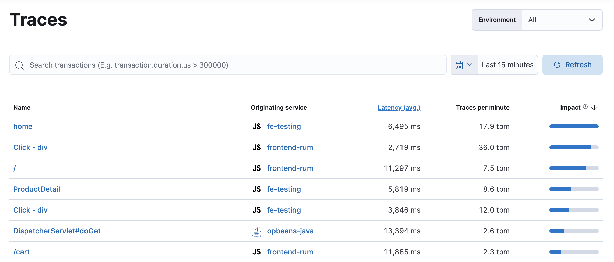
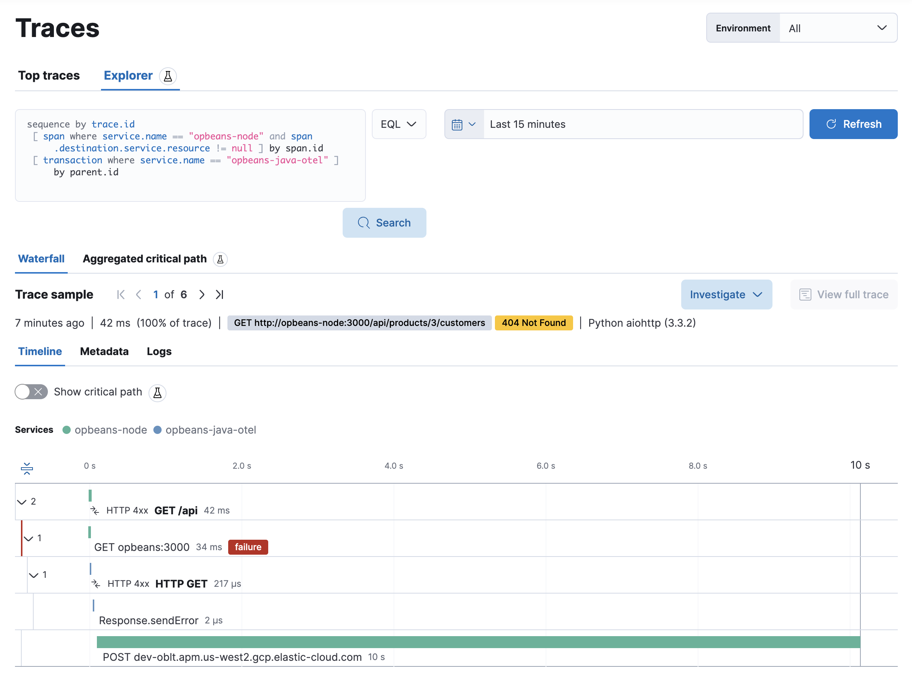

<DocBadge template="technical preview" />

<DocCallOut title="Tip">
Traces link together related transactions to show an end-to-end performance of how a request was served
and which services were part of it.
In addition to the Traces overview, you can view your application traces in the <DocLink slug="/serverless/observability/apm-trace-sample-timeline">trace sample timeline waterfall</DocLink>.
</DocCallOut>

**Traces** displays your application's entry (root) transactions.
Transactions with the same name are grouped together and only shown once in this table.
If you're using <DocLink slug="/serverless/observability/apm-trace-sample-timeline" section="distributed-tracing">distributed tracing</DocLink>,
this view is key to finding the critical paths within your application.

By default, transactions are sorted by _Impact_.
Impact helps show the most used and slowest endpoints in your service &mdash; in other words,
it's the collective amount of pain a specific endpoint is causing your users.
If there's a particular endpoint you're worried about, select it to view its
<DocLink slug="/serverless/observability/apm-transactions" section="transaction-details">transaction details</DocLink>.

You can also use queries to filter and search the transactions shown on this page. Note that only properties available on root transactions are searchable. For example, you can't search for `label.tier: 'high'`, as that field is only available on non-root transactions.

## Trace explorer

<!--  <DocCallOut template="technical preview" />-->
**Trace explorer** is an experimental top-level search tool that allows you to query your traces using [Kibana Query Language (KQL)](http://example.co)/kuery-query.html) or [Event Query Language (EQL)](http://example.co)/eql.html).

Curate your own custom queries, or use the <DocLink slug="/serverless/observability/apm-service-map" /> to find and select edges to automatically generate queries based on your selection:

