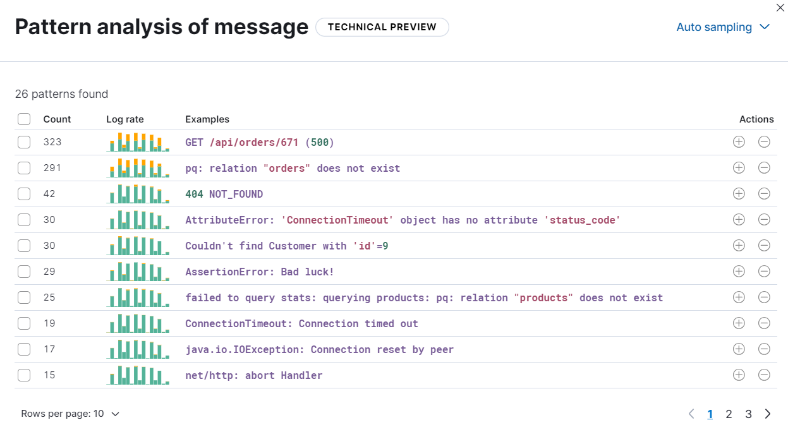

<DocBadge template="technical preview" />

<DocCallOut template="technical_preview" />

Log pattern analysis helps you find patterns in unstructured log messages and makes it easier to examine your data.
When you run a pattern analysis, it performs categorization analysis on a selected field,
creates categories based on the data, and then displays them together in a chart that shows the distribution of each category and an example document that matches the category.
Log pattern analysis is useful when you want to examine how often different types of logs appear in your data set.
It also helps you group logs in ways that go beyond what you can achieve with a terms aggregation.

Log pattern analysis works on every text field.

To run a log pattern analysis:

1. In your Observability project, go to **Discover** and select the **Logs Explorer** tab.

1. Select an integration, for example **Elastic APM error_logs**, and apply any filters that you want.

1. If you don't see any results, expand the time range, for example, to **Last 15 days**.

1. In the **Available fields** list, select the text field you want to analyze, then click **Run pattern analysis**.

    <DocImage size="l" url="../images/run-log-pattern-analysis.png" alt="Run log pattern analysis" />

    The results of the analysis are shown in a table:

    

1. (Optional) Select one or more patterns, then choose to filter for (or filter out) documents that match the selected patterns.
**Logs Explorer** only displays documents that match (or don't match) the selected patterns.
The filter options enable you to remove unimportant messages and focus on the more important, actionable data during troubleshooting.
