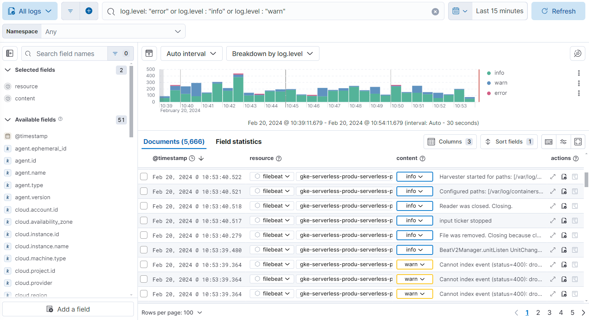

<DocBadge template="technical preview" />

With **Logs Explorer**, based on Discover, you can quickly search and filter your log data, get information about the structure of log fields, and display your findings in a visualization.
You can also customize and save your searches and place them on a dashboard.
Instead of having to log into different servers, change directories, and view individual files, all your logs are available in a single view.

Go to Logs Explorer by opening **Discover** from the navigation menu, and selecting the **Logs Explorer** tab.

## Required PRODUCT_NAME privileges

Viewing data in Logs Explorer requires `read` privileges for **Discover** and **Integrations**.
For more on assigning Kibana privileges, refer to the [(PRODUCT_NAME) privileges](http://example.co)/kibana-privileges.html) docs.

## Find your logs

By default, Logs Explorer shows all of your logs.
If you need to focus on logs from a specific integrations, select the integration from the logs menu:

<DocImage size="l" url="../images/log-menu.png" alt="Screen capture of log menu" />

Once you have the logs you want to focus on displayed, you can drill down further to find the information you need.
For more on filtering your data in Logs Explorer, refer to <DocLink slug="/serverless/observability/filter-and-aggregate-logs" section="filter-logs-in-logs-explorer">Filter logs in Log Explorer</DocLink>.

## Review log data in the documents table

The documents table in Logs Explorer functions similarly to the table in Discover.
You can add fields, order table columns, sort fields, and update the row height in the same way you would in Discover.

Refer to the [Discover](http://example.co)/discover.html) documentation for more information on updating the table.

### Analyze data with smart fields

Smart fields are dynamic fields that provide valuable insight on where your log documents come from, what information they contain, and how you can interact with them.
The following sections detail the smart fields available in Logs Explorer.

#### Resource smart field

The resource smart field shows where your logs are coming from by displaying fields like `service.name`, `container.name`, `orchestrator.namespace`, `host.name`, and `cloud.instance.id`.
Use this information to see where issues are coming from and if issues are coming from the same source.

#### Content smart field

The content smart field shows your logs' `log.level` and `message` fields.
If neither of these fields are available, the content smart field will show the `error.message` or `event.original` field.
Use this information to see your log content and inspect issues.

#### Actions smart field

The actions smart field provides access to additional information about your logs.

**Expand:** (<DocIcon type="expand" title="expand icon" />) Open the log details to get an in-depth look at an individual log file.

**Degraded document indicator:** (<DocIcon type="pagesSelect" title="degraded document indicator icon" />) Shows if any of the document's fields were ignored when it was indexed.
Ignored fields could indicate malformed fields or other issues with your document. Use this information to investigate and determine why fields are being ignored.

**Stacktrace indicator:** (<DocIcon type="apmTrace" title="stacktrace indicator icon" />) Shows if the document contains stack traces.
This indicator makes it easier to navigate through your documents and know if they contain additional information in the form of stack traces.

## View log details

Click the expand icon (<DocIcon type="expand" title="expand icon" />) in the **Actions** column to get an in-depth look at an individual log file.

These details provide immediate feedback and context for what's happening and where it's happening for each log.
From here, you can quickly debug errors and investigate the services where errors have occurred.

The following actions help you filter and focus on specific fields in the log details:

* **Filter for value (<DocIcon type="plusInCircle" title="filter for value icon" />):** Show logs that contain the specific field value.
* **Filter out value (<DocIcon type="minusInCircle" title="filter out value icon" />):** Show logs that do _not_ contain the specific field value.
* **Filter for field present (<DocIcon type="filter" title="filter for present icon" />):** Show logs that contain the specific field.
* **Toggle column in table (<DocIcon type="listAdd" title="toggle column in table icon" />):** Add or remove a column for the field to the main Logs Explorer table.

## View log quality issues

From the log details of a document with ignored fields, as shown by the degraded document indicator PRODUCT_NAME, expand the **Quality issues** section to see the name and value of the fields that were ignored.
Select **Data set details** to open the **Data Set Quality** page. Here you can monitor your data sets and investigate any issues.

The **Data Set Details** page is also accessible from **Project settings** → **Management** → **Data Set Quality**.
Refer to <DocLink id="serverlessObservabilityMonitorDatasets">Monitor data sets</DocLink> for more information.