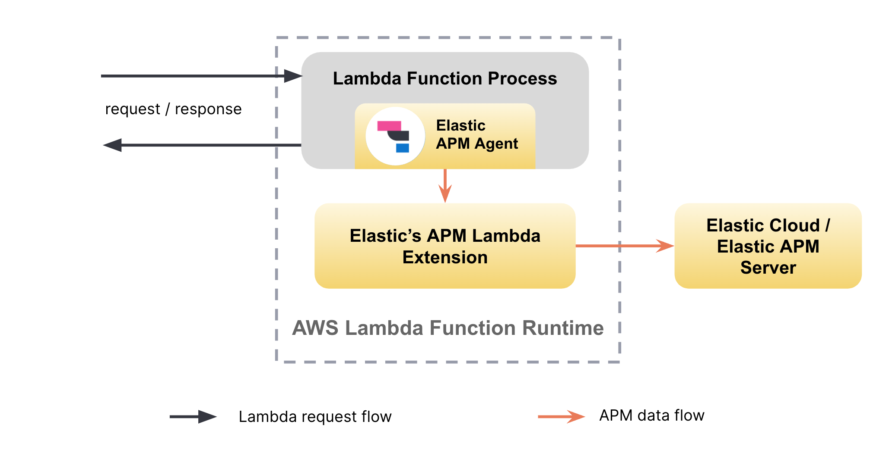

<DocBadge template="technical preview" />

Elastic APM lets you monitor your AWS Lambda functions.
The natural integration of <DocLink slug="/serverless/observability/apm-distributed-tracing">distributed tracing</DocLink> into your AWS Lambda functions provides insights into each function's execution and runtime behavior as well as its relationships and dependencies to other services.

## AWS Lambda architecture

<!--  comes from sandbox.elastic.dev/test-books/apm/lambda/aws-lambda-arch.mdx-->
AWS Lambda uses a special execution model to provide a scalable, on-demand compute service for code execution. In particular, AWS freezes the execution environment of a lambda function when no active requests are being processed. This execution model poses additional requirements on APM in the context of AWS Lambda functions:

1. To avoid data loss, APM data collected by APM agents needs to be flushed before the execution environment of a lambda function is frozen.
1. Flushing APM data must be fast so as not to impact the response times of lambda function requests.

To accomplish the above, Elastic APM agents instrument AWS Lambda functions and dispatch APM data via an [AWS Lambda extension](https://docs.aws.amazon.com/lambda/latest/dg/using-extensions.html).

Normally, during the execution of a Lambda function, there's only a single language process running in the AWS Lambda execution environment. With an AWS Lambda extension, Lambda users run a _second_ process alongside their main service/application process.

By using an AWS Lambda extension, Elastic APM agents can send data to a local Lambda extension process, and that process will forward data on to the managed intake service asynchronously. The Lambda extension ensures that any potential latency between the Lambda function and the managed intake service instance will not cause latency in the request flow of the Lambda function itself.

## Setup

To get started with monitoring AWS Lambda functions, refer to the APM agent documentation:

* [Monitor AWS Lambda Node.js functions](http://example.co)/lambda.html)
* [Monitor AWS Lambda Python functions](http://example.co)/lambda-support.html)
* [Monitor AWS Lambda Java functions](http://example.co)/aws-lambda.html)

<DocCallOut color="warning" title="Important">
  The APM agent documentation states that you can use either an APM secret token or API key to authorize requests to the managed intake service. **However, when sending data to a project, you _must_ use an API key**.

  Read more about API keys in <DocLink slug="/serverless/observability/apm-keep-data-secure" />.
</DocCallOut>
