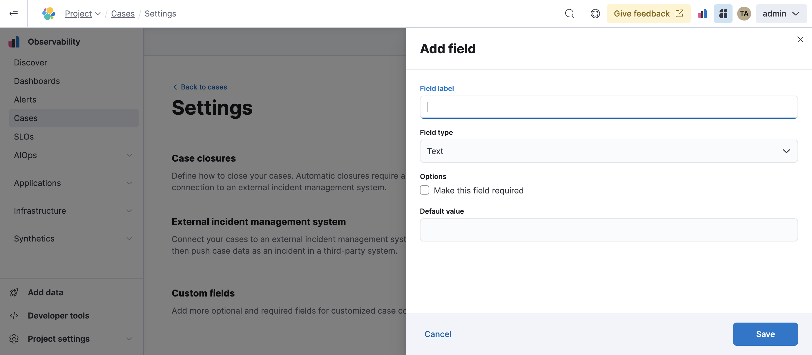

<DocBadge template="technical preview" />

import Roles from '../partials/roles.mdx'

<Roles role="Editor" goal="create and edit connectors" />

To access case settings in an Observability project, go to **Cases** → **Settings**.

<!--  NOTE: This is an autogenerated screenshot. Do not edit it directly.-->

## Case closures

If you close cases in your external incident management system, the cases will remain open in Elastic Observability until you close them manually (the information is only sent in one direction).

To close cases when they are sent to an external system, select **Automatically close cases when pushing new incident to external system**.

## External incident management systems

If you are using an external incident management system, you can integrate Elastic Observability
cases with this system using connectors. These third-party systems are supported:

* PRODUCT_NAME
* PRODUCT_NAME (including PRODUCT_NAME Service Desk)
* PRODUCT_NAME
* PRODUCT_NAME
* PRODUCT_NAME
* PRODUCT_NAME

You need to create a connector to send cases, which stores the information required to interact
with an external system. For each case, you can send the title, description, and comment when
you choose to push the case — for the **Webhook - Case Management** connector, you can also
send the status and severity fields.

<DocCallOut title="Important" color="warning">
<!-- TODO: Verify user roles needed to create connectors...-->
To add, modify, or delete a connector, you must have the Admin user role for the project
(or a more permissive role).
</DocCallOut>

After creating a connector, you can set your cases to
automatically close when they are sent to an external system.

### Create a connector

1. From the **Incident management system** list, select **Add new connector**.
1. Select the system to send cases to: **(PRODUCT_NAME)**, **(PRODUCT_NAME)**, **(PRODUCT_NAME)**, **(PRODUCT_NAME)**,
    or **(PRODUCT_NAME)**.

    
    <!--  NOTE: This is an autogenerated screenshot. Do not edit it directly.-->

1. Enter your required settings. For connector configuration details, refer to:
   -  [(PRODUCT_NAME) connector](http://example.co)/resilient-action-type.html)
   -  [(PRODUCT_NAME) connector](http://example.co)/jira-action-type.html)
   -  [(PRODUCT_NAME) connector](http://example.co)/servicenow-action-type.html)
   -  [(PRODUCT_NAME) connector](http://example.co)/servicenow-sir-action-type.html)
   -  [(PRODUCT_NAME) connector](http://example.co)/swimlane-action-type.html)
   -  [(PRODUCT_NAME) connector](http://example.co)/cases-webhook-action-type.html)

   <!--  Should we be linking out to kibana docs for this info?-->

1. Click **Save**.

### Edit a connector

You can create additional connectors, update existing connectors, and change the connector used to send cases to external systems.

<DocCallOut title="Tip">
You can also configure which connector is used for each case individually. Refer to <DocLink slug="/serverless/observability/create-a-new-case"/>.
</DocCallOut>

To change the default connector used to send cases to external systems:

1. Select the required connector from the **Incident management system** list.

To update an existing connector:

1. Click **Update \<connector name>**.
1. Update the connector fields as required.

## Custom fields

You can add optional and required fields for customized case collaboration.

To create a custom field:

1. In the **Custom fields** section, click **Add field**.

   
    <!--  NOTE: This is an autogenerated screenshot. Do not edit it directly.-->

1. You must provide a field label and type (text or toggle).
   You can optionally designate it as a required field and provide a default value.

When you create a custom field, it's added to all new and existing cases.
In existing cases, new custom text fields initially have null values.

You can subsequently remove or edit custom fields on the **Settings** page.

## Templates

<DocCallOut template="technical_preview" />

You can make the case creation process faster and more consistent by adding templates.
A template defines values for one or all of the case fields (such as severity, tags, description, and title) as well as any custom fields.

To create a template:

1. In the **Templates** section, click **Add template**.

    
    <!--  NOTE: This is an autogenerated screenshot. Do not edit it directly.-->

1. You must provide a template name and case severity. You can optionally add template tags and a description, values for each case field, and a case connector.

When users create cases, they can optionally select a template and use its field values or override them.

<DocCallOut>
If you update or delete templates, existing cases are unaffected.
</DocCallOut>
