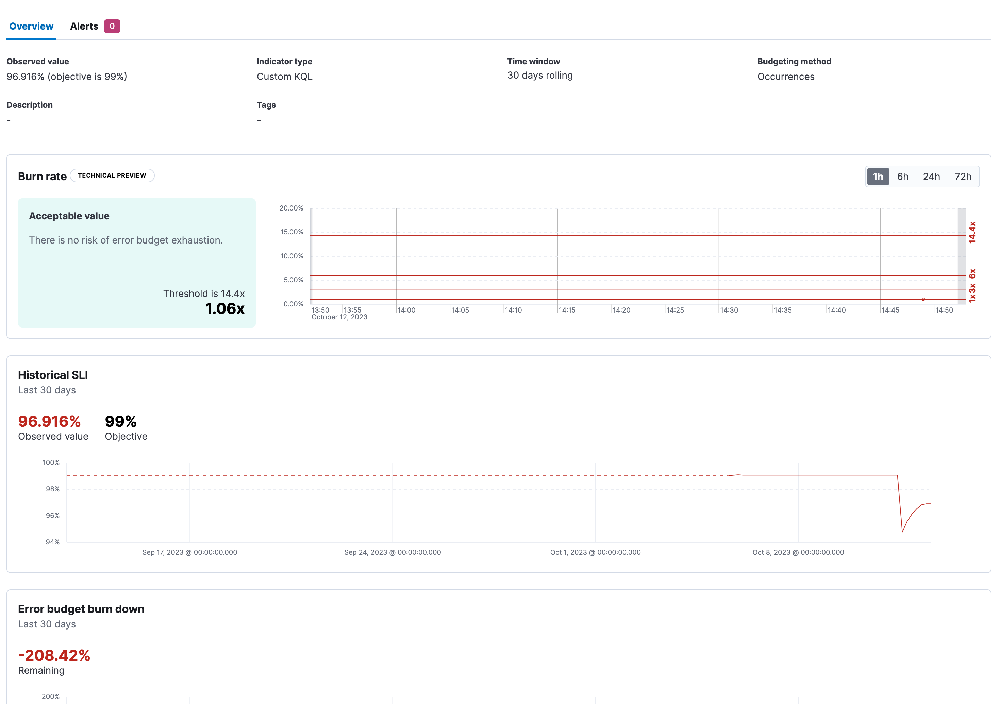
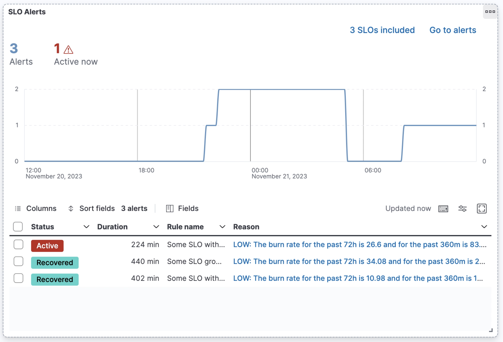

<DocBadge template="technical preview" />

Service-level objectives (SLOs) allow you to set clear, measurable targets for your service performance, based on factors like availability, response times, error rates, and other key metrics.
You can define SLOs based on different types of data sources, such as custom KQL queries and APM latency or availability data.

Once you've defined your SLOs, you can monitor them in real time, with detailed dashboards and alerts that help you quickly identify and troubleshoot any issues that may arise.
You can also track your progress against your SLO targets over time, with a clear view of your error budgets and burn rates.

## Important concepts
The following table lists some important concepts related to SLOs:

|  |  |
|---|---|
| **Service-level indicator (SLI)** | The measurement of your service's performance, such as service latency or availability. |
| **SLO** | The target you set for your SLI. It specifies the level of performance you expect from your service over a period of time. |
| **Error budget** | The amount of time that your SLI can fail to meet the SLO target before it violates your SLO. |
| **Burn rate** | The rate at which your service consumes your error budget. |

## SLO overview

From the SLO overview, you can see all of your SLOs and a quick summary of what's happening in each one:

Select an SLO from the overview to see additional details including:

* **Burn rate:** the percentage of bad events over different time periods (1h, 6h, 24h, 72h) and the risk of exhausting your error budget within those time periods.
* **Historical SLI:** the SLI value and how it's trending over the SLO time window.
* **Error budget burn down:** the remaining error budget and how it's trending over the SLO time window.
* **Alerts:** active alerts if you've set any <DocLink slug="/serverless/observability/create-slo-burn-rate-alert-rule">SLO burn rate alert rules</DocLink> for the SLO.

## Search and filter SLOs

You can apply searches and filters to quickly find the SLOs you're interested in.

* **Apply structured filters:** Next to the search field, click the **Add filter** <DocIcon type="plusInCircleFilled" size="m" title="Add filter icon" /> icon to add a custom filter. Notice that you can use `OR` and `AND` to combine filters. The structured filter can be disabled, inverted, or pinned across all apps.
* **Enter a semi-structured search:** In the search field, start typing a field name to get suggestions for field names and operators that you can use to build a structured query. The semi-structured search will filter SLOs for matches, and only return matching SLOs.
* Use the **Status** and **Tags** menus to include or exclude SLOs from the view based on the status or defined tags.

There are also options to sort and group the SLOs displayed in the overview:

* **Sort by**: SLI value, SLO status, Error budget consumed, or Error budget remaining.
* **Group by**: None, Tags, Status, or SLI type.
* Click icons to switch between a card view (<DocIcon type="apps" size="m" title="Card view icon" />), list view (<DocIcon type="list" size="m" title="List view icon" />), or compact view (<DocIcon type="tableDensityCompact" size="m" title="Compact view icon]" />).

## SLO dashboard panels

SLO data is also available as Dashboard _panels_.
Panels allow you to curate custom data views and visualizations to bring clarity to your data.

Available SLO panels include:

* **SLO Overview**: Visualize a selected SLO's health, including name, current SLI value, target, and status.
* **SLO Alerts**: Visualize one or more SLO alerts, including status, rule name, duration, and reason. In addition, configure and update alerts, or create cases directly from the panel.

To learn more about Dashboards, see <DocLink slug="/serverless/observability/dashboards">Dashboards</DocLink>.

## Next steps

Get started using SLOs to measure your service performance:

<!-- TODO: Find out if any special privileges are required to grant access to SLOs and document as required. Classic doclink was  <DocLink id="enObservabilitySloPrivileges">Configure SLO access</DocLink>-->

* <DocLink slug="/serverless/observability/create-an-slo"/>
* <DocLink slug="/serverless/observability/create-slo-burn-rate-alert-rule"/>
* <DocLink slug="/serverless/observability/view-alerts"/>
* <DocLink slug="/serverless/observability/triage-slo-burn-rate-breaches"/>
