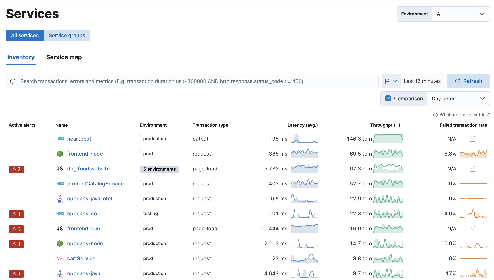

<DocBadge template="technical preview" />

import FeatureBeta from '../partials/feature-beta.mdx'

The **Services** inventory provides a quick, high-level overview of the health and general
performance of all instrumented services.

To help surface potential issues, services are sorted by their health status:
**critical** → **warning** → **healthy** → **unknown**.
Health status is powered by <DocLink slug="/serverless/observability/apm-integrate-with-machine-learning">machine learning</DocLink>
and requires anomaly detection to be enabled.

In addition to health status, active alerts for each service are prominently displayed in the service inventory table. Selecting an active alert badge brings you to the **Alerts** tab where you can learn more about the active alert and take action.

<DocCallOut title="Tip">
   Want to monitor service logs without instrumenting all your services? Learn about our <DocLink slug="/serverless/observability/new-experience-services">new services experience.</DocLink>
</DocCallOut>

## Service groups

import Roles from '../partials/roles.mdx'

<Roles role="Editor" goal="create and manage service groups" />

<FeatureBeta feature="Service grouping" />

Group services together to build meaningful views that remove noise, simplify investigations across services,
and combine related alerts.

<!--  This screenshot is reused in the alerts docs-->
<!--  Ensure it has an active alert showing-->

To create a service group:

1. In your Observability project, go to **Applications** → **Services**.
1. Switch to **Service groups**.
1. Click **Create group**.
1. Specify a name, color, and description.
1. Click **Select services**.
1. Specify a [Kibana Query Language (KQL)](http://example.co)/kuery-query.html) query to select
   services for the group. Services that match the query within the last 24 hours will be assigned to the group.

<DocCallOut title="Note">

Once a service group has been saved, this list of services within it is static.
If a newly added service matches the KQL query, it will not be automatically added to the service group.
Similarly, if a service stops matching the KQL query, it will not be removed from the group.

To update the list of services within a group,
edit the service group, click **Refresh** next to the KQL query, and click **Save group**.

</DocCallOut>

### Examples

Not sure where to get started? Here are some sample queries you can build from:

* **Group services by environment**: To group "production" services, use `service.environment : "production"`.
* **Group services by name**: To group all services that end in "beat", use `service.name : *beat`. This will match services named "Auditbeat", "Heartbeat", "Filebeat", and so on.
