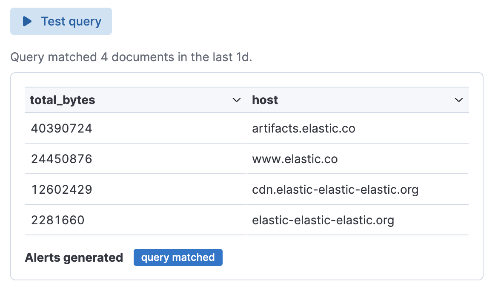
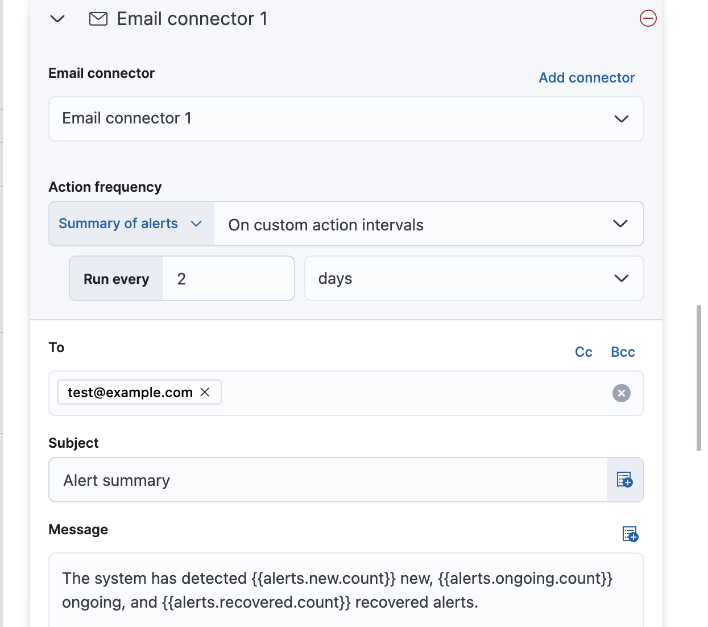
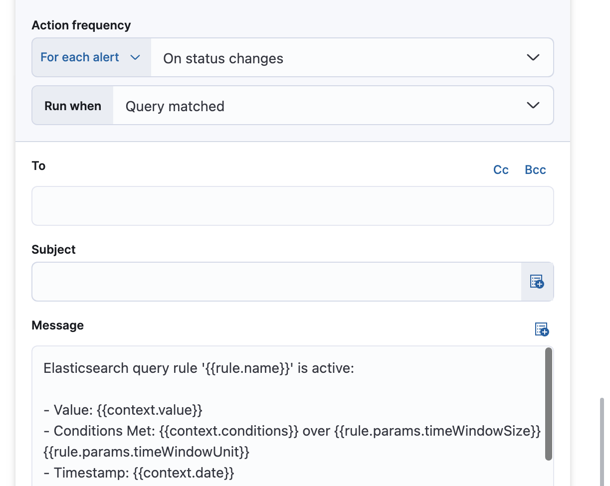
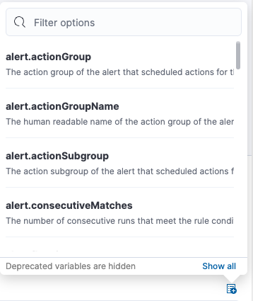

<p><DocBadge template="technical preview" /></p>

import Connectors from './alerting-connectors.mdx'

import Roles from '../partials/roles.mdx'

<Roles role="Editor" goal="create Elasticsearch query rules" />

<div id="rule-type-es-query"></div>

The PRODUCT_NAME query rule type runs a user-configured query, compares the number of
matches to a configured threshold, and schedules actions to run when the
threshold condition is met.

1. To access this page, from your project go to **Alerts**.
1. Click **Manage Rules** → **Create rule**.
1. Under **Select rule type**, select **(PRODUCT_NAME) query**.

An PRODUCT_NAME query rule can be defined using PRODUCT_NAME Query Domain Specific Language (DSL), PRODUCT_NAME Query Language (ES|QL), PRODUCT_NAME Query Language (KQL), or Lucene.

## Define the conditions

When you create an PRODUCT_NAME query rule, your choice of query type affects the information you must provide.
For example:


<!--  NOTE: This is an autogenerated screenshot. Do not edit it directly.-->

1. Define your query

    If you use [query DSL](http://example.co)/query-dsl.html), you must select an index and time field then provide your query.
    Only the `query`, `fields`, `_source` and `runtime_mappings` fields are used, other DSL fields are not considered.
    For example:

    ```sh
    {
      "query":{
        "match_all" : {}
      }
    }
    ```

    If you use [KQL](http://example.co)/kuery-query.html) or [Lucene](http://example.co)/lucene-query.html), you must specify a data view then define a text-based query.
    For example, `http.request.referrer: "https://http://example.com"`.

    <DocBadge template="technical preview" />
    If you use [ES|QL](http://example.co)/esql.html), you must provide a source command followed by an optional series of processing commands, separated by pipe characters (|).
    For example:

    ```sh
    FROM kibana_sample_data_logs
    | STATS total_bytes = SUM(bytes) BY host
    | WHERE total_bytes > 200000
    | SORT total_bytes DESC
    | LIMIT 10
    ```

1. If you use query DSL, KQL, or Lucene, set the group and theshold.

      When
          : Specify how to calculate the value that is compared to the threshold. The value is calculated by aggregating a numeric field within the time window. The aggregation options are: `count`, `average`, `sum`, `min`, and `max`. When using `count` the document count is used and an aggregation field is not necessary.
      Over or Grouped Over
          : Specify whether the aggregation is applied over all documents or split into groups using up to four grouping fields.
          If you choose to use grouping, it's a [terms](http://example.co)/search-aggregations-bucket-terms-aggregation.html) or [multi terms aggregation](http://example.co)/search-aggregations-bucket-multi-terms-aggregation.html); an alert will be created for each unique set of values when it meets the condition.
          To limit the number of alerts on high cardinality fields, you must specify the number of groups to check against the threshold.
          Only the top groups are checked.

      Threshold
          : Defines a threshold value and a comparison operator  (`is above`,
          `is above or equals`, `is below`, `is below or equals`, or `is between`). The value
          calculated by the aggregation is compared to this threshold.

1. Set the time window, which defines how far back to search for documents.

1. If you use query DSL, KQL, or Lucene, set the number of documents to send to the configured actions when the threshold condition is met.

1. If you use query DSL, KQL, or Lucene, choose whether to avoid alert duplication by excluding matches from the previous run.
    This option is not available when you use a grouping field.

1. Set the check interval, which defines how often to evaluate the rule conditions.
    Generally this value should be set to a value that is smaller than the time window, to avoid gaps in
    detection.

## Test your query

Use the **Test query** feature to verify that your query is valid.

If you use query DSL, KQL, or Lucene, the query runs against the selected indices using the configured time window.
The number of documents that match the query is displayed.
For example:


<!--  NOTE: This is an autogenerated screenshot. Do not edit it directly.-->

<DocBadge template="technical preview" />  If you use an ES|QL query, a table is displayed. For example:



If the query is not valid, an error occurs.

## Add actions

<!-- TODO: Decide whether to use boiler plate text, or the text from the source docs for this rule.-->

You can optionally send notifications when the rule conditions are met and when they are no longer met.
In particular, this rule type supports:

* alert summaries
* actions that run when the query is matched
* recovery actions that run when the rule conditions are no longer met

For each action, you must choose a connector, which provides connection information for a service or third party integration.

<DocAccordion buttonContent="Connector types">
Connectors provide a central place to store connection information for services and integrations with third party systems.
The following connectors are available when defining actions for alerting rules:

<Connectors />

For more information on creating connectors, refer to <DocLink slug="/serverless/action-connectors">Connectors</DocLink>.

</DocAccordion>

<DocAccordion buttonContent="Action frequency">
After you select a connector, you must set the action frequency. You can choose to create a **Summary of alerts** on each check interval or on a custom interval. For example, you can send email notifications that summarize the new, ongoing, and recovered alerts at a custom interval:


<!--  NOTE: This is an autogenerated screenshot. Do not edit it directly.-->

Alternatively, you can set the action frequency to **For each alert** and specify the conditions each alert must meet for the action to run.

With the **Run when** menu you can choose how often the action runs (at each check interval, only when the alert status changes, or at a custom action interval).
You must also choose an action group, which indicates whether the action runs when the query is matched or when the alert is recovered.
Each connector supports a specific set of actions for each action group.
For example:


<!--  NOTE: This is an autogenerated screenshot. Do not edit it directly.-->

You can further refine the conditions under which actions run by specifying that actions only run when they match a KQL query or when an alert occurs within a specific time frame.

</DocAccordion>

<DocAccordion buttonContent="Action variables">
Use the default notification message or customize it.
You can add more context to the message by clicking the Add variable icon <DocIcon type="indexOpen" title="Add variable" /> and selecting from a list of available variables.



The following variables are specific to this rule type.
You can also specify [variables common to all rules](http://example.co)/rule-action-variables.html).

<DocDefList>
    <DocDefTerm>`context.conditions`</DocDefTerm>
    <DocDefDescription>
        A string that describes the threshold condition. Example:
        `count greater than 4`.
    </DocDefDescription>
    <DocDefTerm>`context.date`</DocDefTerm>
    <DocDefDescription>
        The date, in ISO format, that the rule met the condition.
        Example: `2022-02-03T20:29:27.732Z`.
    </DocDefDescription>
    <DocDefTerm>`context.hits`</DocDefTerm>
    <DocDefDescription>
        The most recent documents that matched the query. Using the
        [Mustache](https://mustache.github.io/) template array syntax, you can iterate
        over these hits to get values from the PRODUCT_NAME documents into your actions.

        For example, the message in an email connector action might contain:

        ```
        Elasticsearch query rule '{{rule.name}}' is active:

        {{#context.hits}}
        Document with {{_id}} and hostname {{_source.host.name}} has
        {{_source.system.memory.actual.free}} bytes of memory free
        {{/context.hits}}
        ```

        The documents returned by `context.hits` include the [`_source`](http://example.co)/mapping-source-field.html) field.
        If the PRODUCT_NAME query search API's [`fields`](http://example.co)/search-fields.html#search-fields-param) parameter is used, documents will also return the `fields` field,
        which can be used to access any runtime fields defined by the [`runtime_mappings`](http://example.co)/runtime-search-request.html) parameter.
        For example:

        <!--  NOTCONSOLE-->
        ```
        {{#context.hits}}
        timestamp: {{_source.@timestamp}}
        day of the week: {{fields.day_of_week}}  \[\^\1]
        {{/context.hits}}
        ```
        \[\^\1]: The `fields` parameter here is used to access the `day_of_week` runtime field.

        As the [`fields`](http://example.co)/search-fields.html#search-fields-response) response always returns an array of values for each field,
        the [Mustache](https://mustache.github.io/) template array syntax is used to iterate over these values in your actions.
        For example:

        ```
        {{#context.hits}}
        Labels:
        {{#fields.labels}}
        - {{.}}
        {{/fields.labels}}
        {{/context.hits}}
        ```
        <!--  NOTCONSOLE-->
    </DocDefDescription>
    <DocDefTerm>`context.link`</DocDefTerm>
    <DocDefDescription>
        Link to Discover and show the records that triggered the alert.
    </DocDefDescription>
    <DocDefTerm>`context.message`</DocDefTerm>
    <DocDefDescription>
        A message for the alert. Example:
        `rule 'my es-query' is active:`
        `- Value: 2`
        `- Conditions Met: Number of matching documents is greater than 1 over 5m`
        `- Timestamp: 2022-02-03T20:29:27.732Z`
    </DocDefDescription>
    <DocDefTerm>`context.title`</DocDefTerm>
    <DocDefDescription>
        A title for the alert. Example:
        `rule term match alert query matched`.
    </DocDefDescription>
    <DocDefTerm>`context.value`</DocDefTerm>
    <DocDefDescription>
        The value that met the threshold condition.
    </DocDefDescription>
</DocDefList>


</DocAccordion>

## Handling multiple matches of the same document

By default, **Exclude matches from previous run** is turned on and the rule checks
for duplication of document matches across multiple runs. If you configure the
rule with a schedule interval smaller than the time window and a document
matches a query in multiple runs, it is alerted on only once.

The rule uses the timestamp of the matches to avoid alerting on the same match
multiple times. The timestamp of the latest match is used for evaluating the
rule conditions when the rule runs. Only matches between the latest timestamp
from the previous run and the current run are considered.

Suppose you have a rule configured to run every minute. The rule uses a time
window of 1 hour and checks if there are more than 99 matches for the query. The
(PRODUCT_NAME) query rule type does the following:

<!--  [cols="3*<"]-->
|  |  |  |
|---|---|---|
| `Run 1 (0:00)` | Rule finds 113 matches in the last hour: `113 > 99` | Rule is active and user is alerted. |
| `Run 2 (0:01)` | Rule finds 127 matches in the last hour. 105 of the matches are duplicates that were already alerted on previously, so you actually have 22 matches: `22 !> 99` | No alert. |
| `Run 3 (0:02)` | Rule finds 159 matches in the last hour. 88 of the matches are duplicates that were already alerted on previously, so you actually have 71 matches: `71 !> 99` | No alert. |
| `Run 4 (0:03)` | Rule finds 190 matches in the last hour. 71 of them are duplicates that were already alerted on previously, so you actually have 119 matches: `119 > 99` | Rule is active and user is alerted. |
