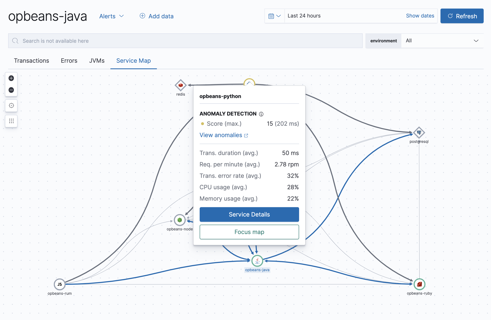

<DocBadge template="technical preview" />

The Machine learning integration initiates a new job predefined to calculate anomaly scores on APM transaction durations.
With this integration, you can quickly pinpoint anomalous transactions and see the health of
any upstream and downstream services.

Machine learning jobs are created per environment and are based on a service's average response time.
Because jobs are created at the environment level,
you can add new services to your existing environments without the need for additional machine learning jobs.

Results from machine learning jobs are shown in multiple places throughout the Applications UI:

* The **Services overview** provides a quick-glance view of the general health of all of your services.

    <!-- TODO: Take this screenshot (no data in oblt now)
    --> -->

* The transaction duration chart will show the expected bounds and add an annotation when the anomaly score is 75 or above.

    <!-- TODO: Take this screenshot (no data in oblt now)
    --> -->

* Service Maps will display a color-coded anomaly indicator based on the detected anomaly score.

    

## Enable anomaly detection

To enable machine learning anomaly detection:

1. In your Observability project, go to any **Applications** page.

1. Click **Anomaly detection**.

1. Click **Create Job**.

1. Machine learning jobs are created at the environment level.
    Select all of the service environments that you want to enable anomaly detection in.
    Anomalies will surface for all services and transaction types within the selected environments.

1. Click **Create Jobs**.

That's it! After a few minutes, the job will begin calculating results;
it might take additional time for results to appear on your service maps.
To manage existing jobs, click **Manage jobs** (or go to **AIOps** → **Anomaly detection**).

## Anomaly detection warning

To make machine learning as easy as possible to set up,
Elastic will warn you when filtered to an environment without a machine learning job.

<!-- TODO: Take this screenshot (no data in oblt now)
--> -->

## Unknown service health

After enabling anomaly detection, service health may display as "Unknown". Here are some reasons why this can occur:

1. No machine learning job exists. See <DocLink slug="/serverless/observability/apm-integrate-with-machine-learning" section="enable-anomaly-detection">Enable anomaly detection</DocLink> to enable anomaly detection and create a machine learning job.
1. There is no machine learning data for the job. If you just created the machine learning job you'll need to wait a few minutes for data to be available. Alternatively, if the service or its environment are new, you'll need to wait for more trace data.
1. No "request" or "page-load" transaction type exists for this service; service health is only available for these transaction types.
