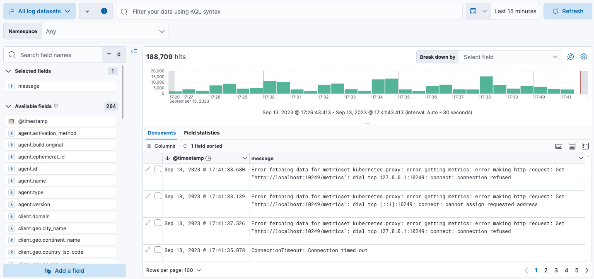
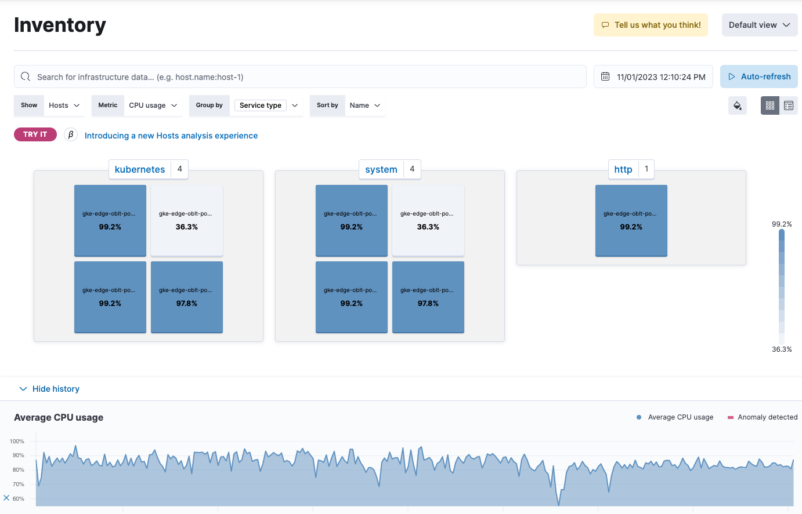
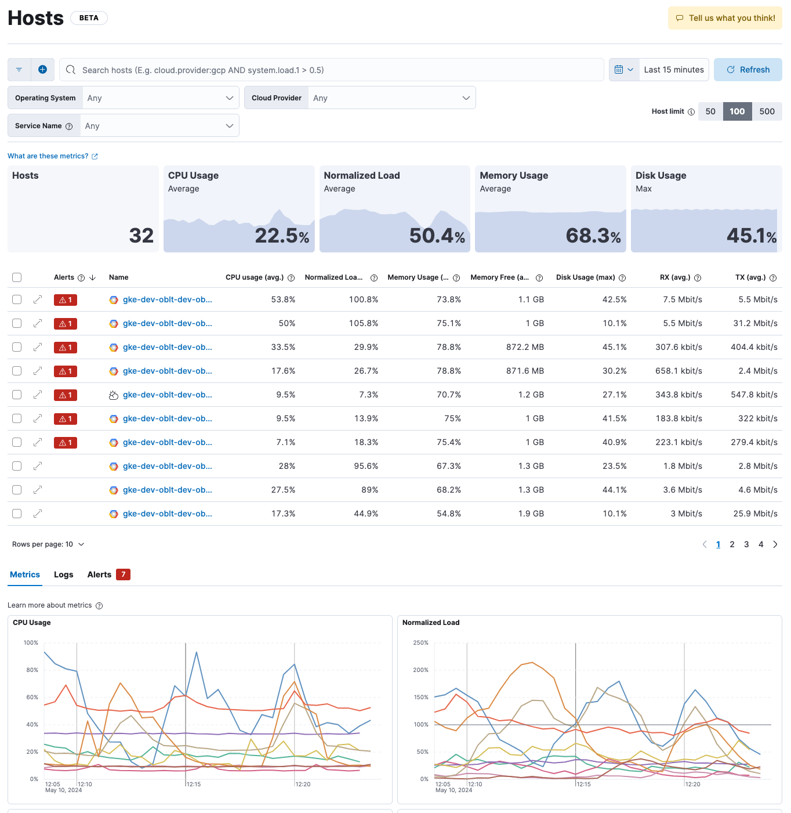
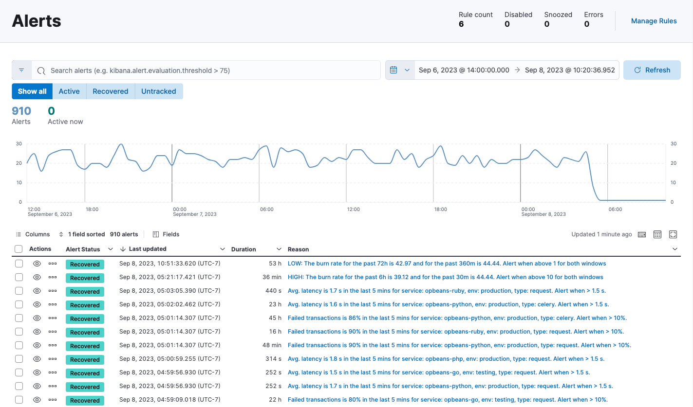
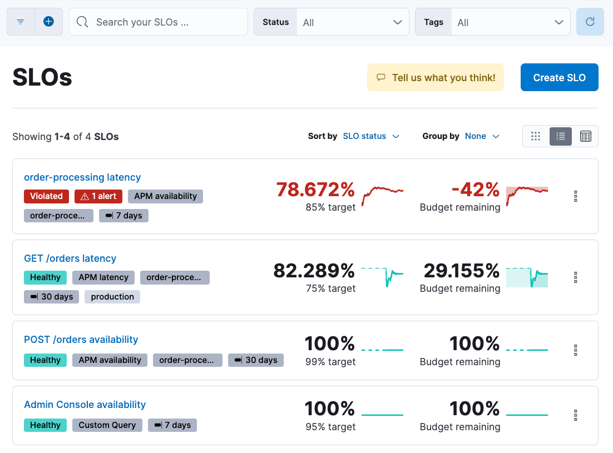
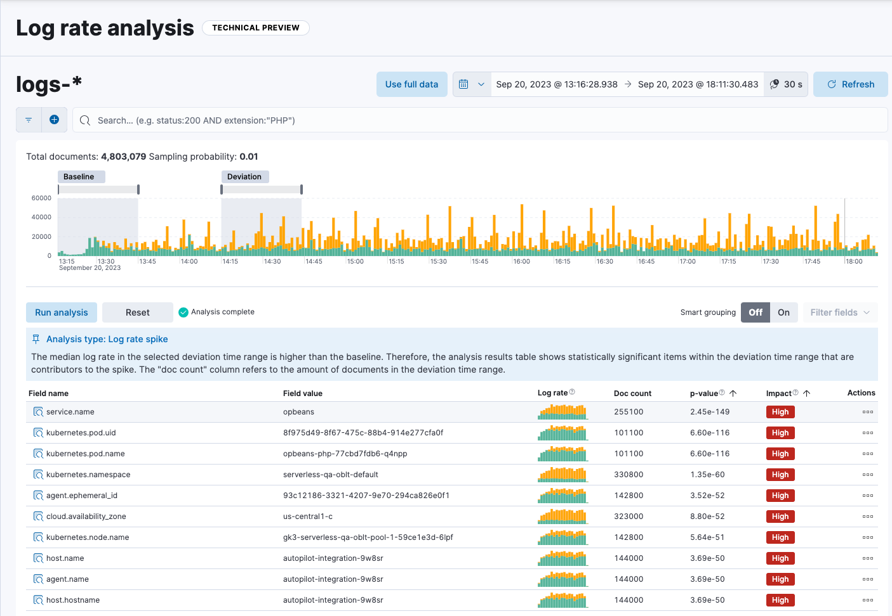

```{toctree}
:caption: Contents:
:hidden:

observability-overview.md
elastic-entity-model.md
projects/create-an-observability-project.md
projects/billing.md

apm/index.md
logging/index.md
synthetics/index.md
alerting/index.md
cases/index.md
unsorted/index.md

```

```{caution}
Technical Preview
```

Observability provides granular insights and context into the behavior of applications running in your environments.
It's an important part of any system that you build and want to monitor.
Being able to detect and fix root cause events quickly within an observable system is a minimum requirement for any analyst.

Elastic Observability provides a single stack to unify your logs, metrics, and application traces.
Ingest your data directly to your Observability project, where you can further process and enhance the data,
before visualizing it and adding alerts.

<DocImage size="xl" flatImage url="./images/serverless-capabilities.svg" alt="Elastic Observability overview diagram"/>

<div id="apm-overview"></div>

## Log monitoring

Analyze log data from your hosts, services, Kubernetes, Apache, and many more.

In **Logs Explorer** (powered by Discover), you can quickly search and filter your log data,
get information about the structure of the fields, and display your findings in a visualization.



<DocLink slug="/serverless/observability/log-monitoring">Learn more about log monitoring →</DocLink>

<div id="synthetic-monitoring-overview"></div>

<!--  RUM is not supported for this release.-->

<!--  Synthetic monitoring is not supported for this release.-->

<!--  Universal Profiling is not supported for this release.-->

## Application performance monitoring (APM)

Instrument your code and collect performance data and errors at runtime by installing APM agents like Java, Go, .NET, and many more.
Then use Observability to monitor your software services and applications in real time:

* Visualize detailed performance information on your services.
* Identify and analyze errors.
* Monitor host-level and APM agent-specific metrics like JVM and Go runtime metrics.

The **Service** inventory provides a quick, high-level overview of the health and general performance of all instrumented services.


<DocLink slug="/serverless/observability/apm">Learn more about Application performance monitoring (APM) →</DocLink>

<div id="metrics-overview"></div>

## Infrastructure monitoring

Monitor system and service metrics from your servers, Docker, Kubernetes, Prometheus, and other services and applications.

The **Infrastructure** UI provides a couple ways to view and analyze metrics across your infrastructure:

The **Inventory** page provides a view of your infrastructure grouped by resource type.



The **Hosts** page provides a dashboard-like view of your infrastructure and is backed by an easy-to-use interface called Lens.



From either page, you can view health and performance metrics to get visibility into the overall health of your infrastructure.
You can also drill down into details about a specific host, including performance metrics, host metadata, running processes,
and logs.

<DocLink slug="/serverless/observability/infrastructure-monitoring">Learn more about infrastructure monitoring → </DocLink>

## Synthetic monitoring

Simulate actions and requests that an end user would perform on your site at predefined intervals and in a controlled environment.
The end result is rich, consistent, and repeatable data that you can trend and alert on.

For more information, see <DocLink slug="/serverless/observability/monitor-synthetics">Synthetic monitoring</DocLink>.

## Alerting

Stay aware of potential issues in your environments with Observability’s alerting
and actions feature that integrates with log monitoring and APM.
It provides a set of built-in actions and specific threshold rules
and enables central management of all rules.

On the **Alerts** page, the **Alerts** table provides a snapshot of alerts occurring within the specified time frame. The table includes the alert status, when it was last updated, the reason for the alert, and more.



<DocLink slug="/serverless/observability/alerting">Learn more about alerting → </DocLink>

## Service-level objectives (SLOs)

Set clear, measurable targets for your service performance,
based on factors like availability, response times, error rates, and other key metrics.
Then monitor and track your SLOs in real time,
using detailed dashboards and alerts that help you quickly identify and troubleshoot issues.

From the SLO overview list, you can see all of your SLOs and a quick summary of what’s happening in each one:



<DocLink slug="/serverless/observability/slos">Learn more about SLOs → </DocLink>

## Cases

Collect and share information about observability issues by creating cases.
Cases allow you to track key investigation details,
add assignees and tags to your cases, set their severity and status, and add alerts,
comments, and visualizations. You can also send cases to third-party systems,
such as ServiceNow and Jira.


<DocLink slug="/serverless/observability/cases">Learn more about cases → </DocLink>

## AIOps

Reduce the time and effort required to detect, understand, investigate, and resolve incidents at scale
by leveraging predictive analytics and machine learning:

* Detect anomalies by comparing real-time and historical data from different sources to look for unusual, problematic patterns.
* Find and investigate the causes of unusual spikes or drops in log rates.
* Detect distribution changes, trend changes, and other statistically significant change points in a metric of your time series data.



<DocLink slug="/serverless/observability/aiops">Learn more about AIOps →</DocLink>
