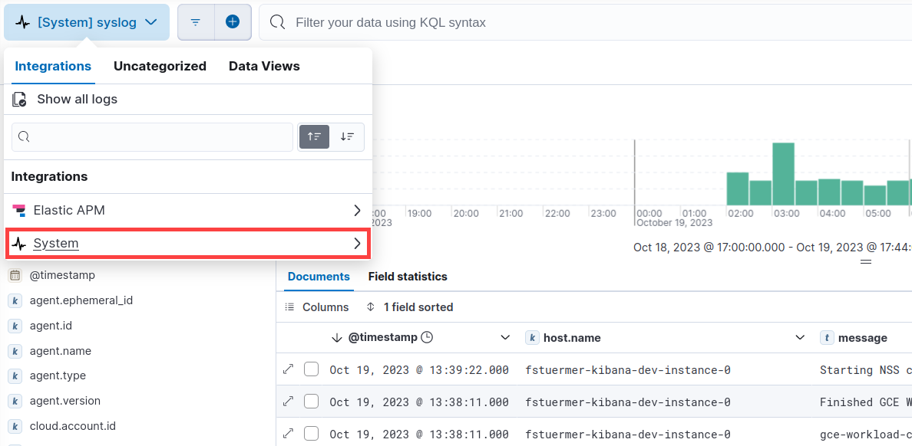

<DocBadge template="technical preview" />

import Roles from '../partials/roles.mdx'

<Roles role="Admin" goal="onboard log data" />

In this guide you'll learn how to onboard system log data from a machine or server,
then observe the data in **Logs Explorer**.

To onboard system log data:

1. <DocLink slug="/serverless/observability/create-an-observability-project">Create a new Observability project</DocLink>, or open an existing one.
1. In your Observability project, go to **Add data**.
1. Under **Collect and analyze logs**, click **Stream host system logs**.
When the page loads, the system integration is installed automatically, and a new API key is created.
Make sure you copy the API key and store it in a secure location.
1. Follow the in-product steps to install and configure the PRODUCT_NAME.
Notice that you can choose to download the agent's config automatically to avoid adding it manually.

After the agent is installed and successfully streaming log data, you can view the data in the UI:

1. From the navigation menu, go to **Discover** and select the **Logs Explorer** tab. The view shows all log datasets.
Notice you can add fields, change the view, expand a document to see details,
and perform other actions to explore your data.
1. Click **All log datasets** and select **System** → **syslog** to show syslog logs.

## Next steps

Now that you've added system logs and explored your data,
learn how to onboard other types of data:

* <DocLink slug="/serverless/observability/stream-log-files"/>
* <DocLink slug="/serverless/observability/apm-get-started"/>

To onboard other types of data, select **Add Data** from the main menu.

/Users/brandon/Documents/GitHub/markitpy-poc/docs/source/obs-serverless/alerting/create-manage-rules.md:138: WARNING: image file not readable: obs-serverless/alerting/images/create-and-manage-rules/user-alerting-individual-enable-disable.png [image.not_readable]
/Users/brandon/Documents/GitHub/markitpy-poc/docs/source/obs-serverless/alerting/create-manage-rules.md:144: WARNING: image file not readable: obs-serverless/alerting/images/create-and-manage-rules/user-alerting-snooze-panel.png [image.not_readable]
/Users/brandon/Documents/GitHub/markitpy-poc/docs/source/obs-serverless/alerting/view-alerts.md:68: WARNING: image file not readable: obs-serverless/alerting/images/view-observability-alerts/-observability-view-alert-details.png [image.not_readable]
/Users/brandon/Documents/GitHub/markitpy-poc/docs/source/obs-serverless/alerting/view-alerts.md:92: WARNING: image file not readable: obs-serverless/alerting/images/view-observability-alerts/-observability-alert-table-toolbar-buttons.png [image.not_readable]
/Users/brandon/Documents/GitHub/markitpy-poc/docs/source/obs-serverless/apm/apm-integrate-with-machine-learning.md:22: WARNING: image file not readable: obs-serverless/apm/images/machine-learning-integration/apm-service-quick-health.png [image.not_readable]
/Users/brandon/Documents/GitHub/markitpy-poc/docs/source/obs-serverless/apm/apm-integrate-with-machine-learning.md:27: WARNING: image file not readable: obs-serverless/apm/images/machine-learning-integration/apm-apm-ml-integration.png [image.not_readable]
/Users/brandon/Documents/GitHub/markitpy-poc/docs/source/obs-serverless/apm/apm-integrate-with-machine-learning.md:59: WARNING: image file not readable: obs-serverless/apm/images/machine-learning-integration/apm-apm-anomaly-alert.png [image.not_readable]
/Users/brandon/Documents/GitHub/markitpy-poc/docs/source/obs-serverless/apm/apm-observe-lambda-functions.md:30: WARNING: image file not readable: obs-serverless/apm/images/apm-lambda/lambda-cold-start-trace.png [image.not_readable]
/Users/brandon/Documents/GitHub/markitpy-poc/docs/source/obs-serverless/apm/apm-observe-lambda-functions.md:37: WARNING: image file not readable: obs-serverless/apm/images/apm-lambda/lambda-correlations.png [image.not_readable]